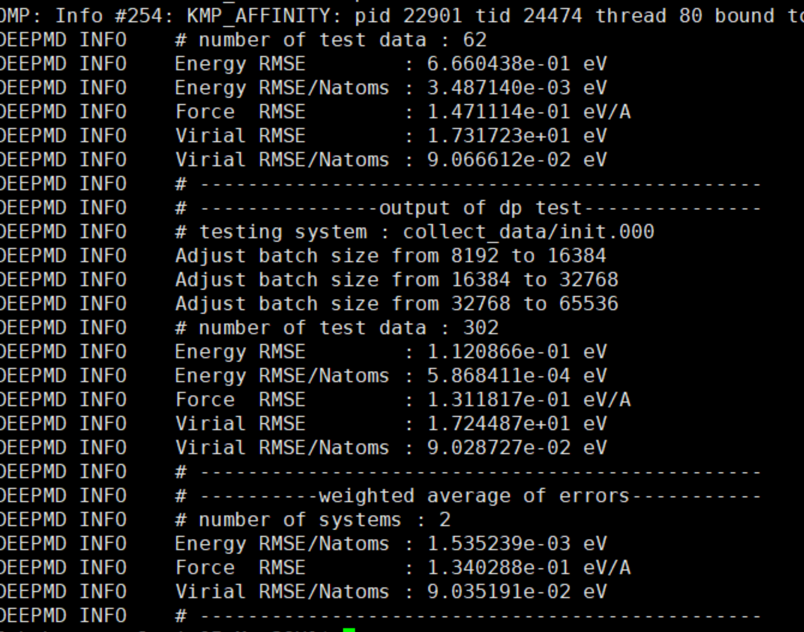
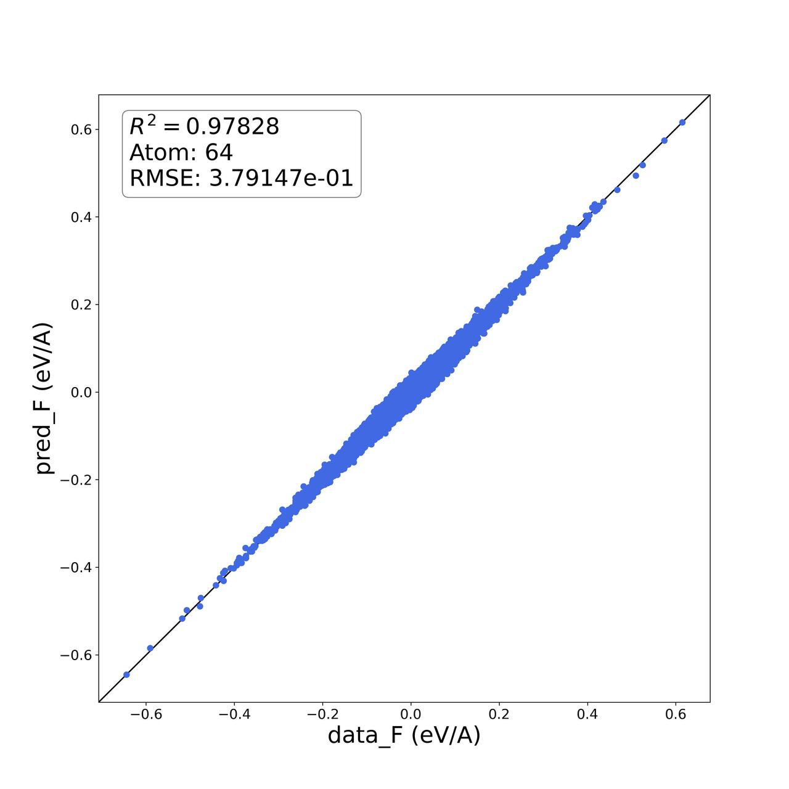

# ABACUS+DPGEN 使用教程

<strong>作者：刘建川，邮箱：liujianchuan2013@163.com</strong>

<strong>审核：陈默涵，邮箱：mohanchen@pku.edu.cn</strong>

<strong>最后更新时间：2023/06/15</strong>

## 1. 介绍

本教程旨在介绍结合 ABACUS（中文名原子算筹，这里基于 ABACUS 3.2.0 版本）和 DPGEN 软件结合生成机器学习 DP 势，这里 ABACUS 扮演了提供第一性原理训练数据的作用<strong>。</strong>本教程以碳化硅（SiC）材料为案例，并且教大家使用 DPGEN autotest 功能，计算 SiC 的 Equation of State (EOS)和弹性常数等性质。先介绍主要软件和计算平台：

<strong>DPGEN</strong><strong>软件：</strong>是一个结合第一性原理软件来自动产生训练数据标签的软件，如果不熟悉 DPGEN 的读者，这里可以推荐大家先阅读 DPGEN 的相关原理文档和说明，熟悉这部分的读者可以跳过：

- [https://docs.deepmodeling.com/projects/dpgen/en/latest/](https://docs.deepmodeling.com/projects/dpgen/en/latest/)
- [https://bohrium-doc.dp.tech/docs/software/DP-GEN](https://bohrium-doc.dp.tech/docs/software/DP-GEN)
- [https://bohrium-doc.dp.tech/docs/software/DP-GEN_init](https://bohrium-doc.dp.tech/docs/software/DP-GEN_init)
- [https://bohrium-doc.dp.tech/docs/software/DP-GEN_autotest](https://bohrium-doc.dp.tech/docs/software/DP-GEN_autotest)
- [https://www.sciencedirect.com/science/article/pii/S001046552030045X?via%3Dihub](https://www.sciencedirect.com/science/article/pii/S001046552030045X?via%3Dihub)

<strong>计算平台：</strong>由于本案例通过 Bohrium 平台教学，所以所用到的 machine.json 文件仅限于 Bohrium 平台使用，如需在其他平台上使用，可参考下面网址，修改 machine.json 文件：

- [https://docs.deepmodeling.com/projects/dpgen/en/latest/run/example-of-machine.html](https://docs.deepmodeling.com/projects/dpgen/en/latest/run/example-of-machine.html)

## 2. 准备

### 2.1 案例下载地址

本教程用到的所有输入文件，均可[点击这里](https://gitee.com/mcresearch/abacus-user-guide/tree/master/examples/abacus-dpgen)下载。

([https://gitee.com/mcresearch/abacus-user-guide/tree/master/examples/abacus-dpgen](https://gitee.com/mcresearch/abacus-user-guide/tree/master/examples/abacus-dpgen))

此外，在 Linux 下可以采用的下载命令是：

```bash
git clone https://gitee.com/mcresearch/abacus-user-guide.git
```

之后进入 `/abacus-user-guide/examples/md` 目录

或者采用 Github 仓库地址：

[https://github.com/MCresearch/abacus-user-guide/tree/master/examples/md](https://github.com/MCresearch/abacus-user-guide/tree/master/examples/md)

下载完之后，应该可以看到三个文件夹：

`init`，`run`，以及 `auto-test`

- `init` 文件夹：包含用于 dpgen init_bulk 步骤所需的输入文件，用户可参考其设置自己的体系参数。
- `run` 文件夹：包含用于 dpgen run 步骤所需的输入文件，用户可参考其设置自己的体系参数。
- `auto-test` 文件夹：包含用于计算弹性常数等性质的输入文件，用户可参考其设置自己的体系参数。

### 2.2 安装相关软件

这里默认读者已经安装好了 ABACUS 软件，本算例中 ABACUS 计算采用的是数值原子轨道的 LCAO（Linear Combination of Atomic Orbitals）方法，因为一般来说 LCAO 会比平面波效率更高，此外读者也可以把密度泛函理论计算部分改成平面波基矢量（后续会讲到）。

开始之前，<strong>请务必安装/更新 dpgen 和 dpdata</strong><strong>（用来转换数据）</strong><strong>到最新版本</strong>：

<strong>1. 安装/更新 dpdata</strong>
`pip install --user git+``https://gitee.com/deepmodeling/dpdata.git@devel`

<strong>2. 安装/更新 dpgen</strong>
`pip install --user git+``https://gitee.com/deepmodeling/dpgen.git@devel`

## 3. 结合 DPGEN 生成 DP 数据的流程

DPGEN 使用流程如下，接下来我们将一一展开介绍：


### 3.1 准备赝势和数值原子轨道文件

本例子所需文件有：

- 模守恒赝势文件，格式为*.upf，也可以使用其他 ABACUS 支持的赝势格式，注意 ABACUS 目前不支持 PAW 方法或者超软赝势。
- 数值原子轨道文件，格式为*.orb，注意这里的数值原子轨道文件要和赝势文件匹配，也就是数值原子轨道是由指定赝势产生的，关于如何生成数值原子轨道，我们会提供中文教程。

注：在 ABACUS 官网上可以下载到赝势和数值原子轨道文件：

[http://abacus.ustc.edu.cn/pseudo/list.htm](http://abacus.ustc.edu.cn/pseudo/list.htm)

本例采用的赝势和轨道是：

- C 的 PBE 模守恒 ONCV 模守恒赝势：C_ONCV_PBE-1.0.upf
- Si 的 PBE 模守恒 ONCV 模守恒赝势：Si_ONCV_PBE-1.0.upf
- C 的 PBE 模守恒 ONCV 赝势对应的数值原子轨道：C_gga_9au_100Ry_3s3p2d.orb
- Si 的 PBE 模守恒 ONCV 赝势对应的数值原子轨道：Si_gga_9au_100Ry_3s3p2d.orb

注：如果是使用平面波基矢量来做密度泛函理论计算，则不需要提供数值原子轨道文件，结合 DPGEN 使用的流程是一致的（仅需要删除调用轨道文件的输入参数即可）。如果采用其他 ABACUS 支持的赝势文件，可自行生成轨道文件（请参考本教程系列的其它相关中文教程）.

注：这里 C_gga_9au_100Ry_3s3p2d.orb 的意思是 C 元素、采用 GGA 泛函、轨道截断半径是 9 a.u.（轨道截断半径越大，则 ABACUS 所需求解 Kohn-Sham 方程的时间会越长，而且这个时间对于轨道半径极其敏感，推荐可以测试不同轨道半径，选取合适的、截断半径小的轨道可以加速计算），100 Ry 是推荐的平面波截断值（哪怕用了数值原子轨道，程序里还是会用平面波来做某些物理量的计算，比如模守恒赝势的局域赝势部分），3s3p2d 表示 3 个 s 径向轨道、3 个 p 轨道、2 个 d 轨道。

### 3.2 准备原子体系的结构文件

本步骤所需的描述原子结构的文件有：

- *.cif

可以从多个渠道下载所需体系的结构文件，本案例主要从 [materials project](https://materialsproject.org/) 网站下载 cif 文件，使用的 SiC 对应多个原子构型，主要有 3C、2H、4H、6H 四个构型，<strong>采用哪些构型取决于用户所研究的体系和性质</strong><strong>，一般可选取所关心的物质温度和压强区间内可能出现的结构</strong>。本案例主要采用<strong>3C 和 2H</strong>构型来演示。

- 3C-SiC：[https://materialsproject.org/materials/mp-8062?formula=SiC](https://materialsproject.org/materials/mp-8062?formula=SiC)
- 2H-SiC: [https://materialsproject.org/materials/mp-7140?_skip=15&formula=SiC](https://materialsproject.org/materials/mp-7140?_skip=15&formula=SiC)
- 4H-SiC: [https://materialsproject.org/materials/mp-11714?formula=SiC](https://materialsproject.org/materials/mp-11714?formula=SiC)
- 6H-SiC: [https://materialsproject.org/materials/mp-7631?formula=SiC](https://materialsproject.org/materials/mp-7631?formula=SiC)

得到了 cif 之后，可以使用下列方法把 cif 转换成 STRU 文件：

1\. 安装 ASE-ABACUS 接口：

```bash
git clone https://gitlab.com/1041176461/ase-abacus.git
cd ase-abacus
python3 setup.py install
```

2\. 设置环境变量（可选）

ABACUS 支持两种基组：平面波（PW）和数值原子轨道（LCAO）。赝势和轨道文件的存放路径可以通过环境变量设置，分别为：`ABACUS_PP_PATH` 和 `ABACUS_ORBITAL_PATH`,设置方法如下：

```bash
PP=${HOME}/pseudopotentials
ORB=${HOME}/orbitals
export ABACUS_PP_PATH=${PP}
export ABACUS_ORBITAL_PATH=${ORB}
```

PW 计算只需要设置 `ABACUS_PP_PATH` 。 LCAO 需要两个都设置：`ABACUS_PP_PATH` and `ABACUS_ORBITAL_PATH` 。

3\. CIF 转 STRU

```python
from ase.io import read, write
from pathlib import Path

cs_dir = './'
cs_vasp = Path(cs_dir, 'SiC.cif') # 修改为自己的cif文件名
cs_atoms = read(cs_vasp, format='cif')
cs_stru = Path(cs_dir, 'STRU')
pp = {'Si':'Si_ONCV_PBE-1.0.upf','C':'C_ONCV_PBE-1.0.upf'} # 修改为所对应的赝势文件名
basis = {'Si':'Si_gga_9au_100Ry_3s3p2d.orb','C':'C_gga_9au_100Ry_3s3p2d.orb'} #  修改为所对应的轨道文件名
write(cs_stru, cs_atoms, format='abacus', pp=pp, basis=basis)
```

运行上述 python 脚本，把 cif 转成 ABACUS 所需的 STRU 文件。

### 3.3 产生初始训练数据

本步骤所需文件有：

- 原子结构文件：`STRU`
- 数值原子轨道文件：`*.orb`
- 赝势文件：`*.upf`
- 布里渊区 k 点采样：`KPT`
- 提交任务的文件：`machine.json`
- DPGEN 的输入参数文件：`param.json`

为每一个构型新建一个名为 `init` 的文件夹。进入该文件夹后，为每个构型都新建一个单独的文件夹，之后单独运行 `dpgen init_bulk` 命令，用于产生接下来的 `dpgen run` 步骤的初始数据集。本案例所提供的初始原子构型为 3C 和 2H 结构，并把赝势文件、轨道文件、STRU 文件放入对应的文件夹里。按照下面链接的案例准备适合自己机器的 `machine.json` 文件，并分别放入 3C 和 2H 文件夹。

- [https://docs.deepmodeling.com/projects/dpgen/en/latest/run/example-of-machine.html](https://docs.deepmodeling.com/projects/dpgen/en/latest/run/example-of-machine.html)

<strong>本教程所用到的文件可以从 Gitee 下载，修改为符合自己的配置即可。</strong>

接下来准备 param.jsion 文件，本步骤最关键的设置也是 param.json 文件设置，案例如下：

```json
{
    "init_fp_style":     "ABACUS",
    "stages":            [1,2,3,4],
    "cell_type":        "diamond",
    "super_cell":        [1, 1, 1],
    "elements":          ["Si","C"],
    "from_poscar":       true,
    "from_poscar_path":  "./STRU",
    "potcars":           ["Si_ONCV_PBE-1.0.upf","C_ONCV_PBE-1.0.upf"], 
    "orb_files":         ["Si_gga_9au_100Ry_3s3p2d.orb","C_gga_9au_100Ry_3s3p2d.orb"],
    "relax_incar":       "./INPUT_rlx",
    "md_incar" :         "./INPUT_md",
    "relax_kpt":         "./KPT",
    "md_kpt":            "./KPT",
    "md_nstep":          10,
    "scale":             [0.99,1.00,1.01],
    "skip_relax":        false,
    "pert_numb":         10,
    "pert_box":          0.03,
    "pert_atom":         0.01,
    "deepgen_templ":     "../generator/template/",
    "coll_ndata":        5000,
    "_comment":          "that's all"
}
```

`init_fp_style` 关键字需设置为 `ABACUS`，如果 `from_poscar` 为 `true`，则会读取 `from_poscar_path` 指定的 `STRU` 文件，且 `cell_type` 关键字失效。`super_cell` 用于括胞，推荐直接使用括胞之后的 STRU 文件，则 `super_cell` 设置为[1, 1, 1]。括胞一般根据需求而定，使得三个方向的 cell 长度约为 6 埃以上（经验性的）。其中还用到了 `*.``upf` 和 `*.``orb` 文件，修改为自己所计算的体系即可。

`init_bulk` 的基本操作流程分为以下 4 个顺序步骤：

1. 生成初始(平衡)结构：输出文件存储在 `00.place_ele`。
2. 产生 MD 起始构象：放缩扰动 `00.place_ele` 中的结构，输出文件存储在 `01.scale_pert`。
3. 执行 AIMD：取 `01.scale_pert` 起始构象调用 vasp 执行少步数 AIMD，输出文件存储在 `02.md`。
4. 整理初始数据：调用 `dpdata` 提取 `02.md` 中 AIMD 各 snapshots 的数据作为初始数据，输出文件存储在 `02.md`。

`param.json` 中将使用 `stages` 关键词的取值 1~4 控制以上 4 步的执行，操作中，各步骤(2, 3, 4 在所需前一步输出文件存在的前提下)可独立执行。

其他具体参数含义可参考 dpgen 官网：

- [https://docs.deepmodeling.com/projects/dpgen/en/latest/init/init-bulk-jdata.html](https://docs.deepmodeling.com/projects/dpgen/en/latest/init/init-bulk-jdata.html)

另外，还需准备两个 ABACUS 输入文件 `INPUT_rlx` 和 `INPUT_md`。

- `INPUT_rlx` 主要用于优化所下载的结构，如下：

```bash
INPUT_PARAMETERS
#Parameters (1.General)
suffix                ABACUS
calculation           cell-relax
#Parameters (2.Iteration)
ecutwfc               100
scf_thr               1e-6
scf_nmax              100
#Parameters (3.Basis)
basis_type        lcao
#Parameters (4.Smearing)
smearing_method       gauss
smearing_sigma        0.002
#Parameters (5.Mixing)
mixing_type           pulay
mixing_beta           0.3
cal_stress            1
```

- `INPUT_md` 主要用于产生一定数量的 AIMD 轨迹，用于 DPGEN 迭代的输出数据，如下：

```bash
INPUT_PARAMETERS 
#Parameters (1.General) 
suffix            ABACUS 
calculation       md 
#Parameters (2.Iteration) 
ecutwfc           100 
scf_thr           1e-6
scf_nmax          100 
#Parameters (3.Basis) 
basis_type        lcao
#Parameters (4.Smearing) 
smearing_method   gauss 
smearing_sigma    0.002
#Parameters (5.Mixing) 
mixing_type       pulay 
mixing_beta       0.3
cal_stress        1
#MD
chg_extrap second-order
md_type           2
md_tfirst         300
md_tlast          300 
md_nstep          10 
md_tfirst         10 
md_tfreq          0.5
```

<strong>注：ABACUS 的 MD 关键字在</strong><strong>此 3.2.0</strong><strong>新版本有所更改，如果是使用的最新版本，请严格参考手册设置关键字，如</strong><strong>md_type</strong><strong>在新版本里改为了</strong><strong>nvt</strong><strong>、</strong><strong>npt</strong><strong>等形式，而不再用数字（如：2）等：</strong>

- 此外，还需准备一个存放布里渊区 k 点的文件，名为 `KPT`：

```bash
K_POINTS
0
Gamma
4 4 4 0 0 0
```

也可在 `INPUT` 文件里直接指定 `kspacing` 参数（注意该参数可选 1 维或者 3 维，如果是表面系统可选 3 维因为真空方向不需要太多 k 点）。

<strong>用户可自行根据所研究体系，设置、更改上述参数。</strong>

<strong>所有</strong><strong>以上</strong><strong>输入文件准备完毕后，</strong><strong>采用如下命令</strong><strong>分别对 3C 和 2H 结构运行 dpgen：</strong>

`nohup dpgen init_bulk param.json machine.json 1>log 2>err&`

上述命令采用后台提交 `dpgen`，等所有计算完成之后，`dpgen` 会自动收集训练 DP 势所需的数据，且转换为 DeePMD-kit 的数据格式，保存在 `./STRU.01x01x01/02.md/sys-0036-0036/deepmd` 目录里。

### 3.4 进行数据采样的迭代

run主流程包含一系列迭代，各迭代会根据所选系综在给定的温度、压力或体积等条件下进行 DPMD 采样与筛选，实现同步学习，所有迭代希望能够有效覆盖训练可靠模型所需的势能面上样本空间。每个迭代依次：基于init 准备的初始训练数据与之前迭代积累的训练数据|训练多个新的模型->使用当前的模型进行DPMD采样，根据模型间预测偏差(model-deviation)|挑选候选 snapshot 构象->将本轮候选 snapshot 构象进行第一性原理标定并加入数据集|扩展数据集 。

以上每个迭代中包含的 3 个步骤分别被命名为 `00.train`，`01.model_devi`，`02.fp`，细节如下：

- <strong>00.train: </strong>使用 init 准备的初始训练数据与之前迭代积累的训练数据，调用 DeepMD-kit 训练多个 (默认 4 个) 模型。模型间的唯一区别来自于初始化神经网络时使用不同的随机数种子。
- <strong>01.model_devi: </strong>指代 model-deviation。 调用 LAMMPS 使用 00.train 的 1 个模型进行 MD 模拟。对于任一 MD 中 snapshot，模型间预测偏差越大意味着当前模型系综对该 snapshot 构象的精度越低，通过引入模型偏差作为误差判据并设定上下限, 挑选出有希望有效改进模型对 PES 整体预测精度的 snapshot 构象，作为准备加入训练数据集的候选构象。
- <strong>02.fp: </strong>调用 ABACUS 对 01.model_devi 选取的候选构象进行第一性原理定标(单点计算)，并调用 dpdata 收集整理所得数据加入到训练数据集中。


run 执行后，相关文件即存储在` ....../iter.*(迭代序号)/步骤`文件夹内。以上每个迭代中的每个步骤在实现中被分解为 3 个阶段。以 00.train 为例，3 阶段分别对应: 0：make_train ，为训练任务准备脚本；1： run_train，依据机器配置上传文件并执行训练任务；2：post_train，收集整理分析训练任务的结果。01.model_devi 与 02.fp 的实现步骤与之类似，分别使用 3，4，5 及 6，7，8 来标记其阶段。

用输出文件`record.dpgen`来记录进程已经执行过及当前正在执行的阶段。如进程中断后需要续算，DP-GEN将根据此文件的记录来自动恢复run主进程。用户也可根据需求手动修改`record.dpgen`中的记录，来控制接下来将执行哪一阶段的任务：例如，删除最后一阶段(可能未执行完成即中断)的记录，并从前一个已完成阶段后恢复任务。可以通过查看`record.dpgen`文件监控当前任务的执行阶段。

<strong>本步骤所需文件有：</strong>

- `STRU`
- `*.orb`
- `*.upf`
- `machine.json`  （可以直接用 dpgen init bulk 里的）
- `param.json`
- `dpgen init bulk` 产生的初始训练数据

<strong>主要步骤如下：</strong>

1\. 新建一个文件夹，命名为：`run`，并进入此目录里

2\. 在 `run` 文件夹里面新建 `init_conf` 和 `init_data` 文件夹，用于存放 `dpgen init bulk` 产生的构型和初始训练数据

3\. 为了区分不同构型和初始训练数据，在 `init_conf` 和 `init_data` 文件夹里新建名为 `3C` 和 `2H` 的两个文件夹

4\. 拷贝 `dpgen init bulk` 产生的构型和初始训练数据至 `init_conf` 和 `init_data` 文件夹里，如：

```bash
cp -rf yourPath/init/3C/STRU.01x01x01/02.md/sys-0032-0032 yourPath/run/init_conf/3C
cp -rf yourPath/init/2H/STRU.01x01x01/02.md/sys-0036-0036 yourPath/run/init_conf/2H

cp -rf yourPath/init/3C/STRU.01x01x01/02.md/sys-0032-0032/deepmd/* yourPath/run/init_data/3C
cp -rf yourPath/init/2H/STRU.01x01x01/02.md/sys-0036-0036/deepmd/* yourPath/run/init_data/2H
```

5\. 拷贝 `machine.json`、`*.orb` 和 `*.upf` 文件到 `run` 文件夹

6\. 新建一个 `param.json` 文件，如下案例：

```json
{
    "type_map": ["Si","C"],
    "mass_map": [28.085,12.011],
    "init_data_prefix": "./init_data",
    "init_data_sys": [
        "3C",
        "2H"
    ],
    "sys_format":"abacus/stru",
    "sys_configs_prefix": "./init_conf",
    "sys_configs": [
        ["3C/sys-0032-0032/scale-1.000/00****/STRU"],
        ["2H/sys-0036-0036/scale-1.000/00****/STRU"]
    ],
    "_comment": " that's all ",
    "numb_models": 4,
    "default_training_param": {
        "model": {
            "type_map": ["Si","C"],
            "descriptor": {
                "type": "se_e2_a",
                "sel": "auto",
                "rcut_smth": 0.5,
                "rcut": 6.0,
                "neuron": [25, 50, 100],
                "resnet_dt": true,
                "axis_neuron": 12,
                "seed": 1
            },
            "fitting_net": {
                "neuron": [240, 240, 240],
                "resnet_dt": false,
                "seed": 1
            }
        },
        "learning_rate": {
            "type": "exp",
            "start_lr": 0.001,
            "stop_lr":  3.5e-8,
            "decay_steps": 2000
        },
        "loss": {
            "start_pref_e": 0.02,
            "limit_pref_e": 2,
            "start_pref_f": 1000,
            "limit_pref_f": 1,
            "start_pref_v": 0.0,
            "limit_pref_v": 0.0
        },
        "training": {
            "stop_batch": 400000,
            "disp_file": "lcurve.out",
            "disp_freq": 100,
            "numb_test": 10,
            "save_freq": 1000,
            "save_ckpt": "model.ckpt",
            "disp_training": true,
            "time_training": true,
            "profiling": false,
            "profiling_file": "timeline.json",
            "_comment": "that's all"
        }
    },
    "model_devi_dt": 0.002,
    "model_devi_skip": 1000,
    "model_devi_f_trust_lo": 0.05,
    "model_devi_f_trust_hi": 0.10,
    "model_devi_clean_traj": true,
    "model_devi_merge_traj": true,
    "model_devi_jobs": [
      {"sys_idx": [0,1], "temps":[50, 250, 450, 650], "press": [0, 100, 1000, 5000, 10000, 20000, 50000], "trj_freq": 10, "nsteps": 3000, "ensemble": "npt-tri", "_idx": "01"},
      {"sys_idx": [0,1], "temps":[50, 250, 450, 650], "press": [0, 100, 1000, 5000, 10000, 20000, 50000], "trj_freq": 10, "nsteps": 3000, "ensemble": "npt-tri", "_idx": "02"}
     ],
    "fp_style": "abacus",
    "shuffle_poscar": false,
    "fp_task_max": 100,
    "fp_task_min": 5,
    "fp_accurate_threshold": 0.999,
    "fp_accurate_soft_threshold": 0.998,
    "fp_pp_path": "./",
    "fp_pp_files": ["Si_ONCV_PBE-1.0.upf","C_ONCV_PBE-1.0.upf"],
    "fp_orb_files": ["Si_gga_9au_100Ry_3s3p2d.orb","C_gga_9au_100Ry_3s3p2d.orb"],
    "user_fp_params":{
       "ntype": 2,
       "symmetry": 0,
       "basis_type": "lcao",
       "ecutwfc": 100,
       "scf_thr": 1e-6,
       "scf_nmax": 100,
       "smearing_method": "gauss",
       "smearing_sigma": 0.002,
       "mixing_type": "pulay",
       "mixing_beta": 0.3, 
       "cal_force": 1,
       "cal_stress": 1,
       "kspacing": 0.08
    }
}
```

- `type_map`: 用列表方式设置了体系元素，注意顺序要和 STRU 结构文件里一致
- `mass_map`: 记录了对应的原子质量，和 type_map 对应
- `init_data_prefix`：指定初始训练集的位置所在目录，如：`./init_data`
- `init_data_sys`：定位到初始训练集的具体目录，用列表调用多个，即：` ./init_data/2H`
- `sys_format`：指定为 ABACUS 计算的结构，即：`abacus/stru`
- `sys_configs_prefix`：指定探索步所需调用的结构目录，如：`./init_conf`
- `sys_configs`：指定具体的某个构型的目录，用列表调用多个，即：`./init_conf/3C/sys-0032-0032/scale-1.000/00****/STRU`。其中 00****为通配符，dpgen 会遍历 00****所有文件夹的 STRU 文件
- `model_devi_f_trust_lo` 和 `model_devi_f_trust_hi`：可由“init 数据” 中力绝对值的平均值，然后取该值的 20%-50%，设置成 trust level 的上下限。可通过以下 python 脚本计算：（注意指定初始数据位置）

```python
import dpdata
import numpy as np
do06=dpdata.Labeledsystem("./"，"deepmd/raw")
forces = np.absolute(d006["forces"])
af = np.average(forces)
f_trust_lo = af*0.2
f_trust_hi = af*0.5
print(f_trust_lo,f_trust_hi)
```

如果体系温度升高后力的幅度变大，trust level 也要增大设置

- `model_devi_jobs` 里面每一行代表一轮，每轮设置参数为 LAMMPS 进行 MD 模拟的参数
- `fp_style` 指定，使用 ABACUS 进行 SCF 计算
- `user_fp_params` 里面记录 ABACUS 做 SCF 所需的参数
- 其他参数含义见：[https://docs.deepmodeling.com/projects/dpgen/en/latest/run/index.html](https://docs.deepmodeling.com/projects/dpgen/en/latest/run/index.html)

1\. 准备好所有输入文件之后，运行命令：

`nohup dpgen run param.json machine.json 1>log 2>err&`

为后台提交，等待迭代计算完成即可。

2\. 实时监测每轮的 accurate 数据，在 `dpgen.log` 文件里有记录

- 1）模型精度是判断每个迭代中的训练是否收敛的重要指标。

- 2）掌握训练策略有利于快速迭代和收敛。

- 3）经验性：一般体系在 5-8 轮迭代内会上升到 80% 以上，若没有提升，如下方法排查：


  - a. 检查是否是探索步已经崩溃了，收集了许多不合理的结构

  - b. 检查train的loss是否是收敛

  - c. `dp test`查看fp数据是否偏差很大，或者有不合理的情况

  - d. 检查是否是温度设置过高而导致的结构变形严重

  - e. 及时调整trust level，体系温度升高后力的幅度变大，trust level也要增大设置


3\. 一些经验

- 探索步已经崩溃的解决方案

<strong>原因：</strong>DPMD 跑崩的情况一般发生在 训练温度 高于 熔点，而这个温区的结构是从“有序”到“无序态”的 ，其构型易变，采样空间增大，导致训练难度增加。DPMD 跑崩表明当前势函数对这类构型描述较差，大概率是因为前期数据集中这类构型采集的较少；特别是无序态结构的原子距离变小。

<strong>策略：</strong>在熔点附近的 参数设置需要平滑缓慢对待，增加“MD 轨迹保存频率”；缩短“MD 模拟步数”或降低“MD 步长”，增加迭代次数，其 DP 训练势函数稳定后再延长 MD 模拟步数。

- ABACUS 收敛性测试

对每种体系一定要先做各个参数的收敛性测试，特别是：K 点、能量截断，也可测试 scf_thr 降低计算量。另外，对于赝势文件也一定要做性质测试，看是否能够正确描述目标体系的性质

- 每隔几轮做一次 dp test

初始数据得到后，第一轮生成了 dp 势之后，一定要检查 trian 步骤收敛情况和做 dp test。dp test 用如下命令：

`dp  test  -m  frozen_model.pb  -s  ./collect_data  -n   2000   -d  out.out`

frozen_model.pb 为生成的 4 个模型中的某一个，2000 为 collect_data 里面单个结构的总数。out.out 会生成 out.e.out out.f.out  out.f.out  三个偏差数据文件，用于作图判断模型优劣屏幕会输出每个构型力、能量等误差平均值，也可用*.out 文件做出 DP 和 DFT 偏差图，如：





经验性的，力的精度在 1e-2 量级，能量精度在 5e-3 量级，说明模型比较好。

## 4. 计算材料 EOS 和弹性常数的流程

本例子里提供了一个 `auto-test` 文件夹，进入之后可以结合 DPGEN 的 `auto-test` 命令计算材料 EOS、弹性常数的流程

auto-test 的详细流程，可以从如下网页教程查阅：

[https://bohrium-doc.dp.tech/docs/software/DP-GEN_autotest](https://bohrium-doc.dp.tech/docs/software/DP-GEN_autotest)

这里贴上如何使用 ABACUS 来计算材料 EOS、弹性常数的相关输入文件

`relaxation.json`：

```json
{
    "structures":    ["conf"],
    "interaction": {
        "type":         "abacus",
        "incar":        "./INPUT",
        "potcar_prefix":"./",
        "potcars": {"Si": "Si_ONCV_PBE-1.0.upf","C": "C_ONCV_PBE-1.0.upf"},
                "orb_files": {"Si":"Si_gga_9au_100Ry_3s3p2d.orb","C":"C_gga_9au_100Ry_3s3p2d.orb"}
    },
    "relaxation": {
            "cal_type": "relaxation",
            "cal_setting":{
            "input_prop": "./INPUT"
            }
     }
}
```

`property.json`：

```json
{
    "structures":    ["conf"],
    "interaction": {
        "type":         "abacus",
        "incar":        "./INPUT",
        "potcar_prefix":"./",
        "potcars": {"Si": "Si_ONCV_PBE-1.0.upf","C": "C_ONCV_PBE-1.0.upf"},
        "orb_files": {"Si":"Si_gga_9au_100Ry_3s3p2d.orb","C":"C_gga_9au_100Ry_3s3p2d.orb"}
    },
    "properties": [
        {
         "type":         "eos",
         "vol_start":    0.9,
         "vol_end":      1.1,
         "vol_step":     0.02
        },
        {
         "type":         "elastic",
         "norm_deform":  1e-2,
         "shear_deform": 1e-2
        }
        ]
}
```

`INPUT`：

```bash
INPUT_PARAMETERS
calculation       cell-relax
symmetry          0
basis_type        lcao
ecutwfc           100.0
scf_thr           1.0e-06
scf_nmax          100
smearing_method   gauss
smearing_sigma    0.002
mixing_type       pulay
mixing_beta       0.3
cal_force         1
cal_stress        1
kspacing          0.10
```

在当前目录建立一个 conf 文件夹，把 STRU 文件放进去，依次运行下面命令：

```bash
dpgen autotest make relaxation.json 
nohup dpgen autotest run relaxation.json machine.json & 
dpgen autotest post relaxation.json 
dpgen autotest make property.json 
nohup dpgen autotest run property.json machine.json & 
dpgen autotest post property.json
```

计算完成之后，会在 `conf/elastic_00/result.out` 文件里记录弹性常数、模量等信息，`conf/eos_00/result.out` 里记录 EOS 等数据。

以上即为采用 ABACUS 3.2.0 和 DPGEN 软件结合的介绍，若有任何问题，欢迎给我们反馈。
