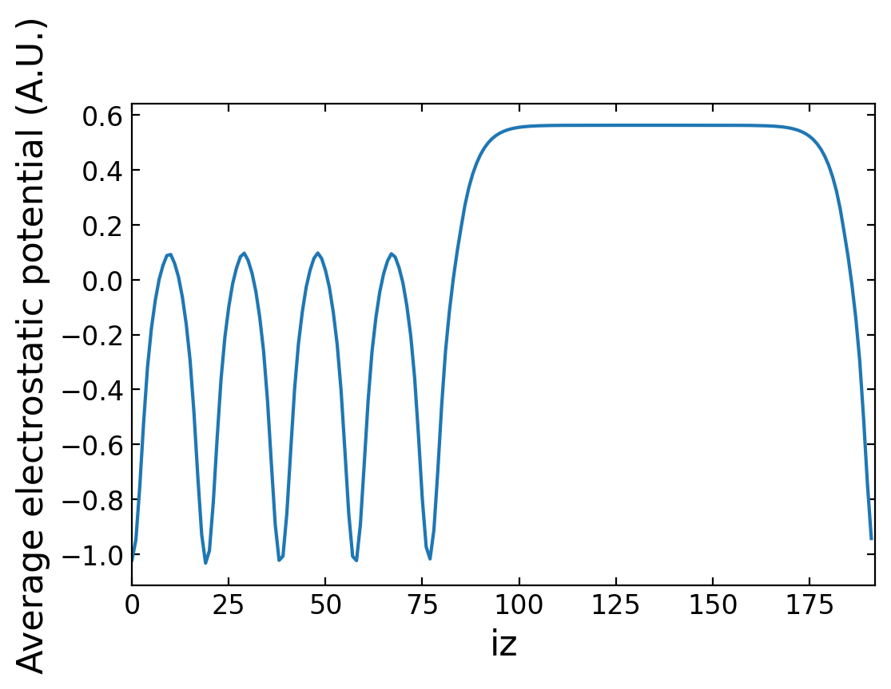

# 采用 ABACUS 进行表面计算（一）：静电势和功函数

<strong>作者：孙亮，邮箱：l.sun@pku.edu.cn</strong>

<strong>审核：陈默涵，邮箱：mohanchen@pku.edu.cn</strong>

<strong>最后更新时间：2023/10/01</strong>

# 一、背景

静电势（electrostatic potential），也叫电势，是指将单位电荷从参考点移动到场内某一点所做的功。

在密度泛函理论的框架下，静电势$$V_{static}$$定义为

$$
V_{static} = V_{H}+V_{ext}+V_{efield}+V_{dipole}+...
$$

其中$$V_{H} = \int{\frac{\rho(r')}{|r-r'|}dr'}$$为电子产生的静电势，$$V_{ext}$$为离子势（赝势的局域部分），$$V_{field}$$为外加电场项，$$V_{dipole}$$为偶极修正项，输出静电势和输出局域势的差别在于有没有输出交换关联势。

在处理表面等体系时，静电势可用于计算<strong>功函数</strong>等物理量，并进一步用于催化活性、化学反应机理以及电子输运性质等性质的计算与分析。

ABACUS 提供了直接输出静电势的接口，并提供了对其进行后处理的 python 脚本。

# 二、ABACUS 中计算静电势具体流程

此功能在平面波基组、原子轨道基组下的 Kohn-Sham DFT（KSDFT），以及随机波函数密度泛函理论和无轨道密度泛函理论中均适用。接下来，我们以平面波基组下的 KSDFT 为例介绍其使用方法，如果需要使用其它的能量求解器，只需要设置 `INPUT` 文件里的 `esolver_type`、`basis_type` 更换能量求解器并设置相应求解器的参数即可。

## 1. 计算实例

### 1.1 输出静电势

下面是输入文件的示例：

`INPUT` 文件记录计算所需主要参数，为了输出静电势，只需要设置 `out_pot`` ``2` 即可（设置 `out_pot 1` 时，会输出总的局域势，2 相比于 1 少输出了交换关联势，具体可以参考线上文档 [https://abacus.deepmodeling.com/en/latest/advanced/input_files/input-main.html#out-pot](https://abacus.deepmodeling.com/en/latest/advanced/input_files/input-main.html#out-pot)）。

```shell
INPUT_PARAMETERS
#Parameters (1.General)
suffix                  example
calculation             scf
ntype                   1
nbands                  40
symmetry                1
pseudo_dir              .

#Parameters (2.Iteration)
ecutwfc                 60
scf_nmax                100

#Parameters (3.Basis)
basis_type              pw

#Parameters (4.Smearing)
smearing_method         gauss
smearing_sigma          0.0074

#Parameters (5.Mixing)
mixing_type             pulay
mixing_beta             0.7

out_pot                 2
```

`STRU` 文件记录元素种类、质量、赝势，晶格矢量，原子坐标等信息

```sql
ATOMIC_SPECIES
Al 13 Al_ONCV_PBE-1.0.upf

LATTICE_CONSTANT
7.6513590200098225  // add lattice constant

LATTICE_VECTORS
0.707106781187    0.000000000000    0.000000000000    
0.000000000000    0.707106781187    0.000000000000    
0.000000000000    0.000000000000    5.000000000000    

ATOMIC_POSITIONS
Direct

Al
0.0
5
    0.000000000000    0.000000000000    0.000000000000 1 1 1
    0.500000000000    0.500000000000    0.100000000000 1 1 1
    0.000000000000    0.000000000000    0.200000000000 1 1 1
    0.500000000000    0.500000000000    0.300000000000 1 1 1
    0.000000000000    0.000000000000    0.400000000000 1 1 1
```

`KPT` 文件

```sql
K_POINTS
0
Gamma
20 20 1 0 0 0
```

如上所示，为了输出静电势，只需要在 `INPUT` 中设置 `out_pot`` ``2`，计算完成后即可在 `OUTOUT.${suffix}` 文件夹下找到下面的 `ElecStaticPot.cube` 文件。

`ElecStaticPot.cube` 文件（记录了实空间格点上的静电势，单位是 A.U.，下面的文档中，我们在括号中加入了注释。此文件可以直接在 [VESTA](https://jp-minerals.org/vesta/en/) 中可视化）

```fortran
Cubefile created from ABACUS SCF calculation. The inner loop is z index, followed by y index, x index in turn.
1 (nspin) 
5（总原子数） 0.0 0.0 0.0（原点坐标）
27（沿x轴格点数nx） 0.200383 0.000000 0.000000（晶格矢量a1的1/nx，in Bohr。即晶格常数a*a1/nx）
27（沿y轴格点数ny） 0.000000 0.200383 0.000000（晶格矢量a2的1/ny，in Bohr）
192（沿z轴格点数nz） 0.000000 0.000000 0.199254（晶格矢量a3的1/ny，in Bohr）
 13（第一个原子的原子序数） 11（赝势中的价电子数） 0.000000 0.000000 0.000000（该原子位置的笛卡尔坐标，in Bohr）
 13 11 2.705164 2.705164 3.825680
 13 11 0.000000 0.000000 7.651359
 13 11 2.705164 2.705164 11.477039
 13 11 0.000000 0.000000 15.302718
 （FFT格点上的数据，z坐标变化最快，接下来依次是y, x，一般为6个数据一行，每走完z的一次循环换一行）
 -1.808618025e+01 -1.683249579e+01 -1.326226499e+01 -8.726520963e+00 -4.859516723e+00 -2.648153424e+00
 -1.754646057e+00 -1.082969997e+00 -7.712730497e-01 -5.301070017e-01 -1.865686936e-01 1.178808012e-03
 1.531960521e-01 2.434659807e-01 3.236379649e-01 3.580121711e-01 3.871087692e-01 4.067752520e-01
 4.191236489e-01 4.303464392e-01 4.269139054e-01 4.072584618e-01 4.012863417e-01 3.694437712e-01
 3.419696568e-01 2.751686292e-01 1.986707660e-01 7.265002162e-02 -9.800789596e-02 -3.699329212e-01
 ...
 5.605648983e-01 5.596641131e-01 5.601221783e-01 5.558024312e-01 5.582286739e-01 5.509517334e-01
 5.484144631e-01 5.474458329e-01 5.413456797e-01 5.310960172e-01 5.220139261e-01 5.057932112e-01
 4.893954664e-01 4.661977108e-01 4.379332539e-01 3.906110446e-01 3.390039472e-01 2.575599458e-01
 1.632711220e-01 1.092880266e-02 -1.657977733e-01 -5.027618535e-01 -7.758727829e-01 -1.023213291e+00
 -1.643162715e+00 -2.406825325e+00 -4.139043775e+00 -7.343485448e+00 -1.119104878e+01 -1.435478802e+01
```

### 1.2 后处理

为了方便计算沿着 z 方向的平均静电势，我们在 `tools/average_pot` 下提供了 python 后处理脚本 `aveElecStatPot.py`，在存放 `ElecStaticPot.cube` 的文件夹下运行

`python path_to_abacus/tools/average_pot`

即可在此文件夹中得到存放了平均静电势的 `ElecStaticPot_AVE` 文件，如下所示。

`ElecStaticPot_AVE` 文件（存放了沿 z 方向的平均静电势，单位是 A.U.。此文件的前 11 行与 `ElecStaticPot.cube` 相同，之后的第一列数为沿着 z 轴的格点指标，第二列数为平均静电势）

```fortran
Average electrostatic potential along z axis
1 (nspin) 
5 0.0 0.0 0.0 
27 0.200383 0.000000 0.000000
27 0.000000 0.200383 0.000000
192 0.000000 0.000000 0.199254
 13 11 0.000000 0.000000 0.000000
 13 11 2.705164 2.705164 3.825680
 13 11 0.000000 0.000000 7.651359
 13 11 2.705164 2.705164 11.477039
 13 11 0.000000 0.000000 15.302718
iz                average
0                -1.021155030e+00
1                -9.476023401e-01
2                -7.542571394e-01
3                -5.200099451e-01
...
189                -5.039597208e-01
190                -7.447469356e-01
191                -9.431350596e-01
```

可视化后如图所示：



### 1.3 功函数

功函数（work function），又称逸出功，描述把电子从固体内部移到真空中所需的最小能量。

在 DFT 计算中，它可以定义为$$V_{vaccum} - E_F$$，其中$$V_{vaccum}$$为真空静电势，可以在 `ElecStaticPot_AVE` 中读到，$$E_F$$为体系费米能，可以用 `grep EFERMI OUT.${suffix}/running_scf.log` 命令从 `OUT.${suffix}/running_scf.log` 文件中提取出来。

对于上面的例子，$$V_{vaccum} = 0.563\ \rm{Ry}$$，$$E_F=3.3293551883\ \rm{eV}\approx0.245\ \rm{Ry}$$，因此功函数为$$V_{vaccum} - E_F = 0.318\ \rm{Ry}$$。

如果大家使用有问题，欢迎写信联系（见上）。
