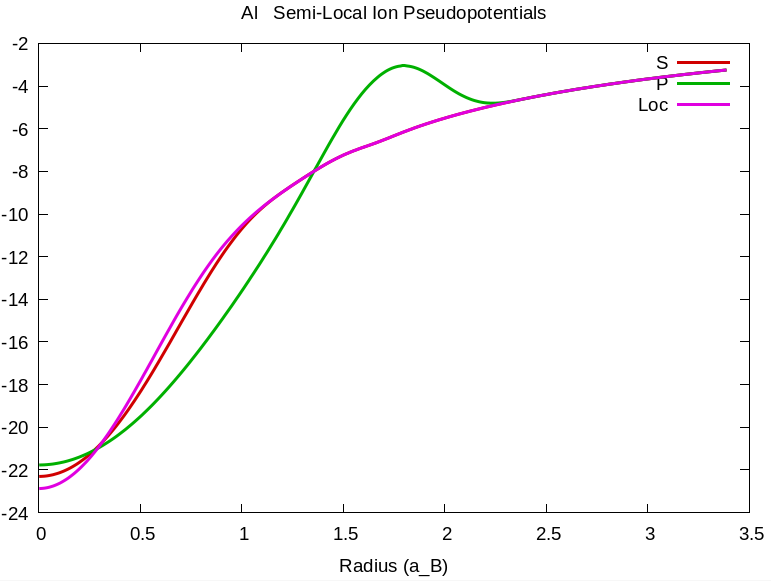
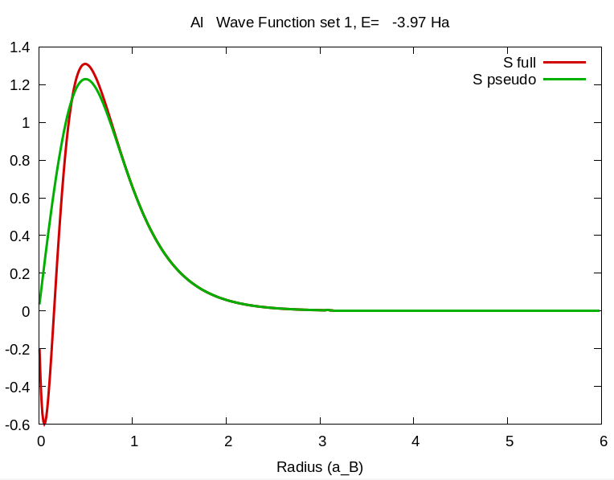
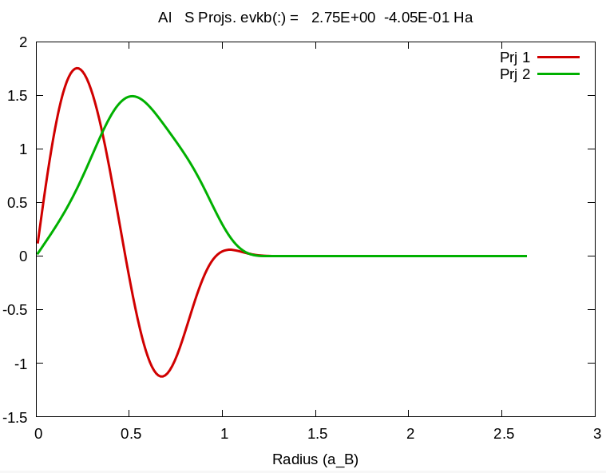
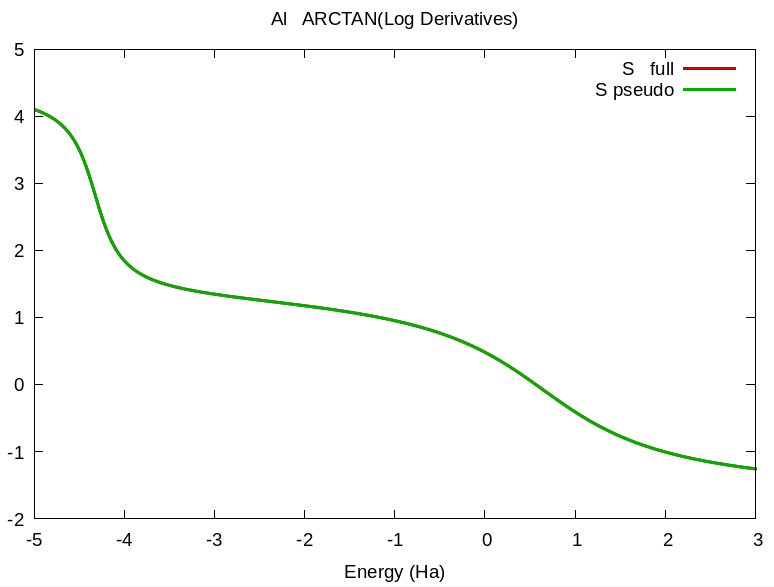

# 模守恒赝势生成方法简介

<strong>作者：陈涛，邮箱：chentao@stu.pku.edu.cn；刘千锐，邮箱：terry_liu@pku.edu.cn</strong>

<strong>审核：陈默涵，邮箱：mohanchen@pku.edu.cn</strong>

<strong>最后更新时间：2023/06/23</strong>

# 1. 介绍

UPF（<strong>unified PP format</strong>）是一种类似 XML 格式的文件格式，用于存储赝势及其相关参数。该格式由 [Quantum ESPRESSO](https://www.quantum-espresso.org/)（QE）团队开发，并已成为许多量子计算软件包的标准格式之一。

ABACUS（截至 v3.2.3）的 Kohn-Sham 密度泛函理论计算主要支持 UPF 格式的<u>模守恒赝势</u>，在使用 ABACUS 过程中，一般可以直接使用网上已经生成好的赝势，常见的下载位置：

- [ABACUS 官网](http://abacus.ustc.edu.cn/pseudo/list.htm)
- [SG15-ONCV](http://www.quantum-simulation.org/potentials/sg15_oncv/index.htm)，参考文献：[Optimization algorithm for the generation of ONCV pseudopotentials](https://www.sciencedirect.com/science/article/pii/S0010465515001897?via%3Dihub)
- [Quantum ESPRESSO 官网](https://www.quantum-espresso.org/pseudopotentials/)中的模守恒赝势
- [pseudo-dojo 官网](http://www.pseudo-dojo.org/)（psp8 格式，需要转换）
- [PWmat 官网](http://www.pwmat.com/potential-download)

但是，在实际计算中，可能这些赝势并不符合当前的需求，这时候就需要自己生成模守恒赝势。可以通过其他格式赝势转换或者利用赝势软件生成两种方式来获得赝势。

注：ABACUS 的无轨道密度泛函理论计算（Orbital-Free Density Functional Theory，简称 OFDFT）需要用到一种特殊的局域势（不包含非局域势），一般采用 [BLPS 局域赝势文件](https://github.com/PrincetonUniversity/BLPSLibrary)而非上文提到的 UPF 文件，如果做 OFDFT 计算的，可以阅读介绍 OFDFT 计算的文档，或者登录 Emily A. Carter 教授主页寻找相关的信息。

# 2. 从其他格式赝势转换

## 2.1 使用 QE upflib 中的 upfconv 进行转换

其支持将 UPF v.1 格式、vdb/van 格式（Vanderbilt US pseudopotential）、cpi/fhi 格式（FHI/abinit）转化成 UPF v.2 格式

```bash
path_to_QE/upflib/upfconv.x -u  *.upf/UPF/vdb/van/cpi/fhi
```

注：这里的 `path_to_QE` 代表下载的 Quantum Espresso 的软件包地址。

注：文件夹 `upflib` 在 QE 5.x 和 6.x 版本名称为 `upftools`，在QE 7.x 版本为 `upflib`。

## 2.2 psp8 格式转换

psp8 格式是 ONCVPSP 软件生成的一种赝势格式，在 Abinit 官网（[pseudo-dojo](http://www.pseudo-dojo.org/)）中，其使用的就是 psp8 的格式，目前没有直接将 psp8 格式的赝势直接转换成 UPF 格式的脚本，但可以将 psp8 中输入文件部分摘抄下来，用 ONCVPSP 软件重新生成 UPF 格式的赝势（具体生成见下面 ONCVPSP 的讲解）。

可供参考的批量处理脚本：[https://github.com/pipidog/ONCVPSP](https://github.com/pipidog/ONCVPSP)

# 3. 赝势的生成

下面介绍三个可以生成 UPF 模守恒赝势的软件，分别是 ONCVPSP，Opium，和 ld1.x

## 3.1 ONCVPSP

### 3.1.1 介绍

[ONCVPSP](http://www.mat-simresearch.com/)（Optimized Norm-Conservinng Vanderbilt PSeudoPotential）是由 D.R. Hamann 等人提出的优化版模守恒赝势，其有更高的精度与效率。ONCVPSP 依赖 Libxc，支持多种交换关联泛函。

参考文献：[Optimized norm-conserving Vanderbilt pseudopotentials](http://dx.doi.org/10.1103/PhysRevB.88.085117)。

### 3.1.2 安装

<strong>I. 首先安装 Libxc</strong>

Libxc 网址：[Libxc - a library of exchange-correlation functionals for density-functional theory](https://www.tddft.org/programs/libxc/)

推荐下载 [libxc-4.3.4](http://www.tddft.org/programs/libxc/down.php?file=4.3.4/libxc-4.3.4.tar.gz)

然后执行如下命令：

```bash
cd libxc-4.3.4
./configure --prefix='PATH/TO/LIBXC' CC=icc F77=ifort F90=ifort
make
make install
```

命令执行完毕后即可在 `PATH/TO/LIBXC` 目录下看到 `bin`,`include` 和 `lib` 三个目录，代表安装成功

<strong>II. 安装 oncvpsp</strong>

推荐下载 [oncvpsp-4.0.1](http://www.mat-simresearch.com/oncvpsp-4.0.1.tar.gz)

然后执行 `cd oncvpsp-4.0.1`，进入文件夹

这时需要修改 `make.inc` 文件

- 修改 `F77 = ifort, F90 = ifort, CC = icc`
- `FFLAGS` 删去 `-ffast-math`
- `LIBS` 改为 `-qmkl="sequential"`
- `LIBS+` 和 `FFLAGS` 中的地址改为自己的 `PATH/TO/LIBXC`

具体如下：

```bash
# System-dependent makefile options for ONCVPSP
# This must be carefully edited before executing "make" in src
#
# Copyright （c） 1989-2019 by D. R. Hamann, Mat-Sim Research LLC and Rutgers
# University
 
##### Edit the following lines to correspond to your compilers ####

F77        = ifort
F90        = ifort
CC         = icc
FCCPP      = cpp

FLINKER     = $（F90）

#FCCPPFLAGS = -ansi -DLIBXC_VERSION=301  #Use this for versions <301
FCCPPFLAGS = -ansi -DLIBXC_VERSION=400  #Use this for versions >400

##### Edit the following optimization flags for your system ####

FFLAGS     = -O3 -funroll-loops
CFLAGS     = -O3                

##### Edit the following LAPACK and BLAS library paths for your system ####

LIBS = -qmkl="sequential"

##### Edit the following for to use libxc if available #####

OBJS_LIBXC =        exc_libxc_stub.o

# oncvpsp is compatible with libxc
# To build oncvpsp with libxc, uncomment the e following lines and edit
# the paths to point to your libxc library and include directories
# make clean in src before rebuilding after changing this

LIBS += -L/PATH/TO/LIBXC/lib -lxcf90 -lxc
FFLAGS += -I/PATH/TO/LIBXC/include

#LIBS += -L/home/drh/abinit/fallbacks/exports/lib -lxcf90 -lxc
#FFLAGS += -I/home/drh/abinit/fallbacks/exports/include

OBJS_LIBXC =        functionals.o exc_libxc.o
```

然后执行如下命令：

```bash
make
```

安装测试完成后，即可在 src 目录下看到 `oncvpsp.x`

可以在 `~/.bashrc` 中增加如下命令将 `oncvpsp.x` 加入环境变量，方便直接调用：

```bash
export PATH=$PATH:/PATH/TO/ONCVPSP/src
```

### 3.1.3 输入文件

输入文件的准备可以参考 `PATH_TO_ONCVPSP/doc/32_Ge_annotated.dat`，或者参考已知 ONCV 的赝势里面的 `<PP_INPUTFILE>` 部分来写。

这里以铝（Al）为例，输入文件 `Al.dat`:

```bash
# ATOM AND REFERENCE CONFIGURATION
# atsym, z, nc, nv, iexc   psfile
Al   13   1   4   4   upf
#
# n, l, f  （nc+nv lines）
1 0 2
2 0 2
2 1 6
3 0 2
3 1 1
#
# PSEUDOPOTENTIAL AND OPTIMIZATION
# lmax
1
#
# l, rc, ep, ncon, nbas, qcut  （lmax+1 lines, l's must be in order）
0 1.29163 0 5 8 10.3003
1 2.40653 0 5 8 7.02214
#
# LOCAL POTENTIAL
# lloc, lpopt, rc（5）, dvloc0
4 5 0.932267 0
#
# VANDERBILT-KLEINMAN-BYLANDER PROJECTORs
# l, nproj, debl  （lmax+1 lines, l's in order）
0 2 0
1 2 0
#
# MODEL CORE CHARGE
# icmod, fcfact
0 0
#
# LOG DERIVATIVE ANALYSIS
# epsh1, epsh2, depsh
-5.0  3.0  0.02
#
# OUTPUT GRID
# rlmax, drl
6.0  0.01
#
# TEST CONFIGURATIONS
# ncnf
0
# nvcnf
#   n    l    f
```

一些可以调整的参数如下：

- `nc`：c = core，芯电子层数
- `nv`：v = valence，价电子层数，调整 `nc` 和 `nv` 可以改变赝势的价电子数
- `iexc`：生成赝势所用的交换关联泛函，详情可参考 ONCVPSP-4.0.1 目录下 doc 内的 `pwscf_exc.txt` 文件，常用的如下

```bash
iexc==3 .or. iexc==-001009, 'functional="PZ"'
iexc==4 .or. iexc==-101130, 'functional="PBE"'
```

- `psfile`：赝势格式，有 `upf` 和 `psp8` 两种。ABACUS 支持 `upf` 的格式
- `rc`:  rc 中较小的为赝势的截断半径。在温度较高或密度较大的温稠密体系，通常需要调整赝势的截断半径，推荐小于 0.7 倍维格纳半径，单位为 Bohr；每个 `l` 对应一个 `rc`，其中最小的为赝势的截断半径
- `rc（5）`：`rc` 都要大于等于 `rc（5）`。例如 Al 的 `l=0` 的 `rc` 为 1.29163 Bohr，`l=1` 的 `rc` 为 2.40653 Bohr，`rc（5）` 为 0.932267 Bohr，因此该赝势的截断半径为 1.29163 Bohr。
- `qcut`：通过调整（+-0.1），直到推荐 ECUT 达到最小
- `dvloc0`：通过调整（+-0.5），直到消除赝势的 GHOST 态（可参考文献 [Phys. Rev. B <strong>41</strong>, 12264 (1990)](https://journals.aps.org/prb/abstract/10.1103/PhysRevB.41.12264)）

### 3.1.4 生成赝势

执行命令：

```bash
oncvpsp.x < Al.dat > Al.out
sed -n '/<UPF version="2.0.1">/,/<\/UPF>/p' Al.out > Al.UPF
```

- 生成完赝势需要查看 `Al.out` 文件，确定没有 GHOST 态（可参考文献 [Phys. Rev. B <strong>41</strong>, 12264 (1990)](https://journals.aps.org/prb/abstract/10.1103/PhysRevB.41.12264)）：

> Testing for highly-localized positive-energy ghosts<br/> l \<radius>/rc E Basis Diag. E Cutoff<br/><br/> 1 0.974041 120.256772 338.98 WARNING - GHOST（+）

如上，出现 WARNING - GHOST 说明有 GHOST，需要调整 dvloc0 （+-0.5）直到消除 GHOST 态

- `sed` 命令是为了从 Al.out 文件中截取赝势文件到 Al.UPF 中

如果同时要画出类似 [Phys. Rev. B <strong>88</strong>, 085117 (2013)](http://dx.doi.org/10.1103/PhysRevB.88.085117) 的图，需要准备输入文件 `Al.dat` 并执行命令：

```bash
sh PATH_TO_ONCVPSP/scripts/run.sh Al
```

可以画出如下的图：



```
图1. 局域势函数与非局域势不同轨道角动量对应的半局域径向势函数
```



```
图2. S赝波函数与全电子波函数对比
```



```
图3. S的双投影波函数
```



```
图4. 不同能级波函数在截断半径处log导数对比，其影响散射性质的计算
```


```
图5. 不同轨道角动量对应的截断能
```

### 3.1.5 优化赝势

- 依次调节不同 `l` 对应的 `qcut`（+-0.1），检查对应 `ECUT（l）` 变化情况，直到 `ECUT（l）` 达到最小

  - 参考的脚本：

```bash
!/bin/bash

qcut=17
dq=0.1
#遍历l=0的qcut从17到25，间隔为0.1，输出其对应的ECUT
while [ `echo "$qcut <= 25" | bc` == "1" ]
do
cat > test.dat <<EOF
# ATOM AND REFERENCE CONFIGURATION
# atsym  z    nc    nv    iexc   psfile
  Al 13.00     1     4     4      upf
#
#   n    l    f        energy （Ha）
    1    0    2.00
    2    0    2.00
    2    1    6.00
    3    0    2.00
    3    1    1.00
#
# PSEUDOPOTENTIAL AND OPTIMIZATION
# lmax
    1
#
#   l,   rc,     ep,   ncon, nbas, qcut
    0   0.68  -3.97500    5    8   $qcut
    1   0.75  -2.55934    5    8   19.4
#
# LOCAL POTENTIAL
# lloc, lpopt,  rc（5）,   dvloc0
    4    5       0.60     0.00000
#
# VANDERBILT-KLEINMAN-BYLANDER PROJECTORs
# l, nproj, debl
    0    2   3.69008
    1    2   2.45967
#
# MODEL CORE CHARGE
# icmod, fcfact
    0   0.00000
#
# LOG DERIVATIVE ANALYSIS
# epsh1, epsh2, depsh
   -5.00    3.00    0.02
#
# OUTPUT GRID
# rlmax, drl
    6.00    0.01
#
# TEST CONFIGURATIONS
# ncnf
    0
# nvcnf
#   n    l    f
EOF

../../src/oncvpsp.x < test.dat > qcut$qcut.out
grep -A 5 "Energy error" qcut$qcut.out > _tmp.txt
E1=`sed -n "6p" _tmp.txt | awk '{print $3}'`
E2=`sed -n "13p" _tmp.txt | awk '{print $3}'`
E3=`sed -n "20p" _tmp.txt | awk '{print $3}'`
E4=`sed -n "27p" _tmp.txt | awk '{print $3}'`

# echo $qcut $E1 $E2 $E3 $E4
if [ `echo "$E1>$E2" | bc` == '1' ] ;then
Emax1=$E1
else
Emax1=$E2
fi

if [ `echo "$E3>$E4" | bc` == '1' ];then
Emax2=$E3
else
Emax2=$E4
fi

echo $qcut $Emax1 $Emax2

qcut=`echo "$qcut+$dq" | bc`
done
```

- 不同的 `l` 都会有对应的能量截断值 `ECUT(l)`。一般 `rc(l)` 越小，对应的 `ECUT(l)` 越大，赝势也就越精确。由于 DFT 计算中的截断能 `ECUT` 是由赝势中较大的那个 `ECUT(l)` 决定，如果不同 `l` 的 `ECUT(l)` 相差很大，可以适当减小较小的 `ECUT（l）` 对应 `l` 的截断半径 `rc`，使得不同 `l` 对应的 `ECUT(l)` 更接近，这样并不会增加赝势计算的 `ECUT`，却可以提升精度。
- 这样调完之后如果有 GHOST 态，需要调整 `dvloc0` （+-0.5）直到消除 GHOST 态，这个赝势才可使用

## 3.2 Opium

[Opium](https://opium.sourceforge.net/) 软件包可以生成 [RRKJ](https://journals.aps.org/prb/abstract/10.1103/PhysRevB.41.1227)、[TM](https://journals.aps.org/prb/abstract/10.1103/PhysRevB.43.1993) 或 [Kerker](https://iopscience.iop.org/article/10.1088/0022-3719/13/9/004/meta) 径向波函数的赝势，官网有 [LDA](https://www.sas.upenn.edu/rappegroup/research/pseudo-potential-lda.html)、[GGA](https://www.sas.upenn.edu/rappegroup/research/pseudo-potential-gga.html) 赝势库（但是某些输入文件已经不匹配最新的 4.1 版本，需要稍作修改）

下载 Opium 之后利用 configure 安装：

```bash
./configure
make
```

输入文件可以参考官网 LDA、GGA 赝势库，也可以参考 PATH_TO_OPIUM/tests，这里以铝（Al）为例，输入文件 `al.param`:

```bash
[Atom]
Al
6
100 2.00  -13.0   # reference configuration
200 2.00   -1.4   # reference configuration
210 6.00   -0.4   # reference configuration
300 2.00   -0.1   # reference configuration
310 0.95  -13.0   # reference configuration
320 -1.0   -0.0   # 这条能带是非束缚态，需要将占据数调成负数，官网给错了
[Pseudo]
3 1.85 1.85 1.97
opt

[Optinfo]
7.07 10    # rc[a.u.] qc[sqrt（Ry）] Nb
7.07 10
7.07 10

[Configs]
3                 # number of valence configurations
#
300  2.00  -13.0   # nlm occ eigen（- means auto-generate）
310  1.00   -6.0 
320  0.00   -6.0
#
300  1.00  -13.0 
310  2.00   -6.0 
320  0.00   -6.0
#
300  2.00  -13.0 
310  0.00   -6.0 
320  0.00   -6.0

[XC]
gga

[Relativity]
srl
```

这里的参数可以参考[官网手册](https://opium.sourceforge.net/guide.html#relativity)

之后执行

```bash
opium al log all  #输出在log文件里，依次执行全电子计算、计算赝势、计算非局域势、可移植性测试
opium al log upf  #生成al.upf的输出文件
upfconv.x -u  al.upf #利用QE的upflib将UPFv.1转化成UPFv.2格式
```

## 3.3 ld1.x

QE 的 atomic 模块中的 `ld1.x` 支持生成赝势。其不仅可以生成模守恒赝势、还支持超软赝势、PAW 方法，支持全相对论、标量（非）相对论赝势（rel, non-rel/sca-rel），其径向波函数支持 [TM](https://journals.aps.org/prb/abstract/10.1103/PhysRevB.43.1993)（更稳定）与 [RRKJ](https://journals.aps.org/prb/abstract/10.1103/PhysRevB.41.1227) 两种方法，支持交换关联近似 7 类 LDA（ pz）,GGA（pbe, pbesol, revpbe, bp, wc, pw91。

下载好 QE 软件后，可以直接安装：

```bash
./configure
make ld1
```

### 3.3.1 pslibrary 赝势库

推荐 ld1.x 生成其自带的 [pslibrary](https://dalcorso.github.io/pslibrary/) 赝势库，下载好 [pslibrary.1.0.0.tar.gz](https://people.sissa.it/dalcorso/pslibrary/pslibrary.1.0.0.tar.gz)，解压，进入文件夹，修改 QE_path 文件，指定 QE 的路径。然后打开 `make_ps` 文件，解锁相应赝势：

```bash
#   These two files generate PAW and US PPs for all elements. These are
#   high accuracy - high kinetic energy cut-off PPs.
#
. ../paw_ps_high.job #默认打开的
. ../us_ps_high.job
#
#   These two files generate additional PAW and US PPs for some elements. 
#   These are less accurate PP than the previous one but require
#   lower kinetic energy cut-off or have less projectors or less semicore
#   states.
#
. ../paw_ps_low.job
. ../us_ps_low.job

#  Uncomment the following line to generate the old pslibrary 0.3.1 PPs. 
#  打开下面的注释，可以解锁其余赝势
#
#. ../paw_ps_collection.job    #可以打开注释
#. ../us_ps_collection.job     #可以打开注释

#  Uncomment the following line to generate the NC-PPs. Be very careful
#  these PPs are completely untested.
#  虽然可以生成，但其也提示该赝势的准确性并不能保证
#
#. ../nc_ps_collection.job     #可以打开注释
```

下面运行

```bash
./make_all_ps
```

就能看到在一个个生成赝势库里的赝势：

```bash
Making   Ac.pz-spfn-kjpaw_psl.1.0.0.in  ...  Done
Making   Ac.pz-spfn-rrkjus_psl.1.0.0.in  ...  Done
Making   Ag.pz-n-kjpaw_psl.1.0.0.in  ...  Done
Making   Ag.pz-n-rrkjus_psl.1.0.0.in  ...  Done
Making   Ag.pz-spn-kjpaw_psl.1.0.0.in  ...  Done
Making   Ag.pz-spn-rrkjus_psl.1.0.0.in  ...  Done
Making   Al.pz-n-kjpaw_psl.1.0.0.in  ...  Done
Making   Al.pz-n-rrkjus_psl.1.0.0.in  ...  Done
Making   Al.pz-nl-kjpaw_psl.1.0.0.in  ...  Done
Making   Al.pz-nl-rrkjus_psl.1.0.0.in  ...  Done
```

如果不想生成所有的元素的赝势，则可以修改 `make_ps` 的 `element`，例如：

```bash
element='C Si Ge'
```

### 3.3.2 生成自己的赝势

参数的详细解释见 `PATH_TO_QE/atomic/Doc/INPUT_LD1.html` 或[线上的文档](https://www.quantum-espresso.org/Doc/INPUT_LD1.html#idm377)（不是最新的，建议前者），输入文件可以参考 [pslibrary](https://dalcorso.github.io/pslibrary/) 赝势库的例子。

这里就简单给个 Al（铝）的例子，准备输入文件 `al.in`：

```bash
&input
   title='Al',
   zed=13.0,
   rel=1,
   config='[Ne] 3s2 3p1 3d-2.0 4f-2.0',
   iswitch=3,
   dft='PBE'
/
&inputp
   pseudotype=2,
   file_pseudopw='Al.pbe-n-nc.UPF', #输入赝势
   lloc=2,
   nlcc=.true.,
   tm=.true.
/
3
3S  1  0  2.00  0.00  2.60  2.60  0.0
3P  2  1  1.00  0.00  2.60  2.60  0.0
3D  3  2  0.00  0.10  2.60  2.60  0.0
```

运行

```bash
ld1.x < al.in
```

即可生成 `Al.pbe-n-nc.UPF` 模守恒赝势。

# 4. 小结

ABACUS 使用的是模守恒赝势，基于模守恒赝势还可以产生数值原子轨道，进行基于数值原子轨道的高效率密度泛函理论计算。有些情况下，网上提供的赝势不能满足需求，这个时候赝势的生成需要对赝势理论有比较深入的了解之后，才能调整好相关参数，生成质量较好的赝势。此外，生成之后，应该经过较为充分的测试，才能保证赝势的可移植性和正确性。如果大家有任何问题，欢迎发 email 至文档开头的邮箱。
