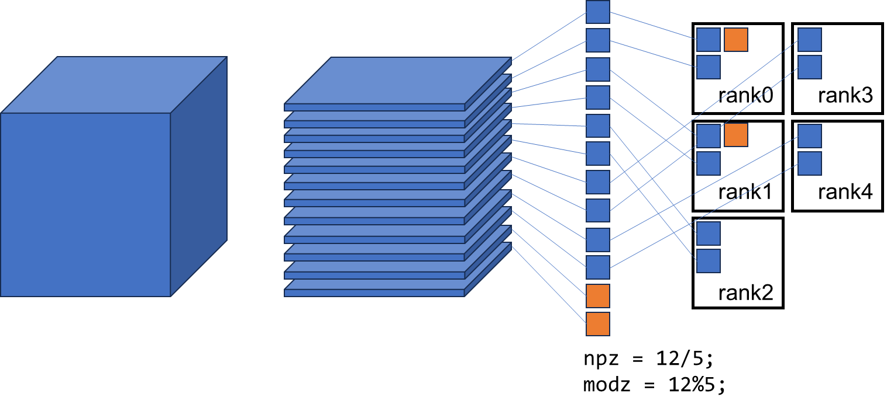
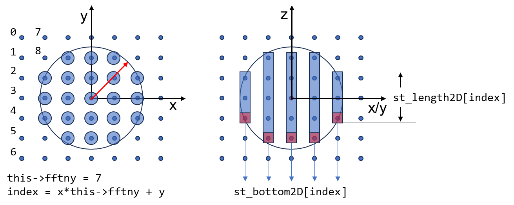
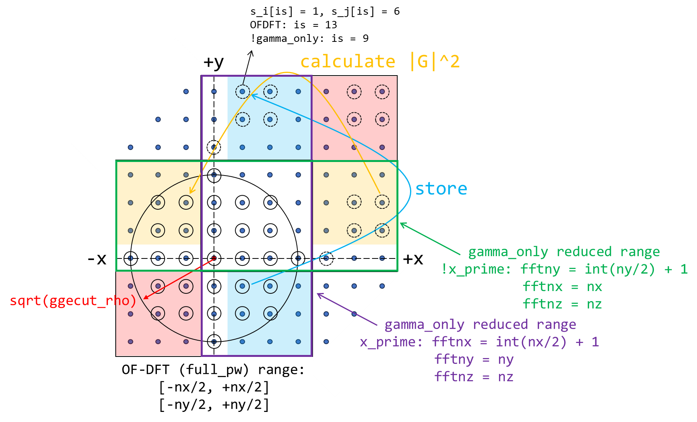
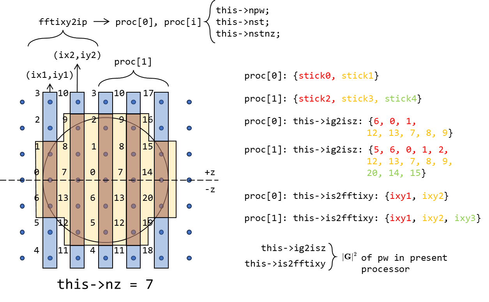
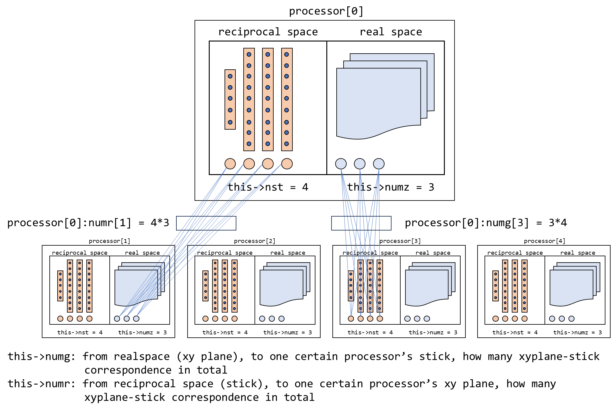
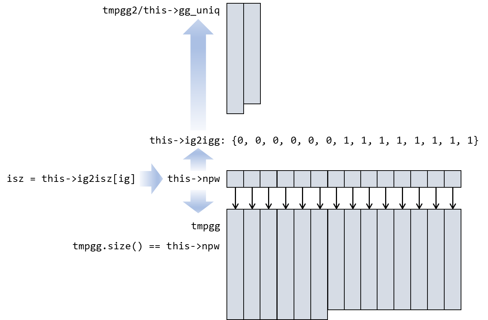

# Introduction to ABACUS: Path to PW calculation - Part 4

<strong>作者：黄一珂，邮箱：huangyk@aisi.ac.cn</strong>

<strong>审核：陈默涵，邮箱：mohanchen@pku.edu.cn</strong>

> 📃<strong>写在前面</strong>
>
> 1. 不脱离代码——避免读者看完手册后对代码没有一丁点概念
> 2. 不堆砌代码解释——避免平庸的代码解释，努力兼顾拉近读者和代码距离的同时，做到提纲挈领，不逐行复制代码后进行停留在代码语义上的解释

# Driver

## Driver::atomic_world()

### Driver::driver_run()

#### 多层继承：Init() functions in esolver class

##### Trigger: ESolver_FP::Init()

###### 平面波格点初始化：PW_Basis:: initgrids()

完成了 `INPUT` 和 `STRU`，以及赝势文件的读取环节，接下来我们来到平面波的初始化设置相关部分。

```cpp
void ESolver_FP::Init(Input& inp, UnitCell& cell)
    {
        ....
        if (inp.nx * inp.ny * inp.nz == 0)
            this->pw_rho->initgrids(inp.ref_cell_factor * cell.lat0, cell.latvec, inp.ecutrho);
        else
            this->pw_rho->initgrids(inp.ref_cell_factor * cell.lat0, cell.latvec, inp.nx, inp.ny, inp.nz);
```

⚠️ 注意，`PW_Basis::initgrids()` 为虚函数（`virtual`），尽管使用基类指针（`pw_rho`），实际调用的函数也是与之同名但不同内容的派生类（`PW_Basis_Big`）成员函数。这一点靠 `ESolver_FP` 的构造函数实现：

```cpp
ESolver_FP::ESolver_FP()
{
        pw_rho = new ModulePW::PW_Basis_Big(GlobalV::device_flag, GlobalV::precision_flag);
        pw_big = static_cast<ModulePW::PW_Basis_Big*>(pw_rho);
        pw_big->setbxyz(INPUT.bx, INPUT.by, INPUT.bz);
        sf.set(INPUT.nbspline);
        this->symm.epsilon = this->symm.epsilon_input = INPUT.symmetry_prec;
}
```

在 `INPUT` 文件中，`nx`, `ny` 和 `nz` 为 FFT 网格大小相关参数，但一般应用场景而言，几乎无用户亲自设置它（对于用户主动设置 `nx`, `ny` 和 `nz` 的情况，`ecutrho`/`ecutwfc` 值的设置无效，将会根据格点情况被重新赋值）。在 `Input::Default()` 中，三个变量的默认值均为 0，因而常规来讲实际唤起 `PW_Basis::initgrads()` 函数的版本计算了 `nx`, `ny` 和 `nz`，其算法和 SIAB 程序完全相同（view source code: [https://github.com/deepmodeling/abacus-develop/blob/develop/source/module_basis/module_pw/pw_init.cpp#L156](https://github.com/deepmodeling/abacus-develop/blob/develop/source/module_basis/module_pw/pw_init.cpp#L156)）：

1. INPUT 中 `ecutrho` 确定以动量$$\mathbf{k}=(0,0,0)$$为球心的球半径
2. 在倒空间确定所有在“球”中的格点（均为整数坐标，因现在最小可分辨距离为倒格子矢量长度，见下 Fig.1），其中每个点都对应一个平面波
3. 以倒空间内 x/y/z 最大/小值为边界组成正方形盒子，进行（2, 3, 5）质数分解，得到可能更大的盒子尺度（nx, ny 和 nz）

相较于 `PW_Basis::initgrids()`，`PW_Basis_Big::initgrids()` 还初始化了 `nbx`, `nby` 和 `nbz` 的值，尽管对于平面波而言整个 `PW_Basis_Big` 都是冗余功能（`PW_Basis_Big` 只是在 LCAO 里面做格点积分的时候会用到）：

```cpp
virtual void initgrids(const double lat0_in,const ModuleBase::Matrix3 latvec_in,
        const double gridecut)
    {
        // generation of nx, ny and nz are omitted here
....
    if(!this->bz)
    {
        this->autoset_big_cell_size(this->bz, ibox[2], this->poolnproc);
    }
    if(!this->bx)
    {
        if(ibox[0] == ibox[2]) this->bx = this->bz;
        else this->autoset_big_cell_size(this->bx, ibox[0]);
    }
    if(!this->by)
    {
        if(ibox[1] == ibox[2]) this->by = this->bz;
        else this->autoset_big_cell_size(this->by, ibox[1]);
    }
    this->bxyz = this->bx * this->by * this->bz;
    if(ibox[0]%this->bx != 0) ibox[0] += (this->bx - ibox[0] % this->bx);
    if(ibox[1]%this->by != 0) ibox[1] += (this->by - ibox[1] % this->by);
    if(ibox[2]%this->bz != 0) ibox[2] += (this->bz - ibox[2] % this->bz);
....
    this->nbx = this->nx / bx;
    this->nby = this->ny / by;
    this->nbz = this->nz / bz;

    delete[] ibox;    
    }
```

回忆 `PW_Basis_Big::bx`, `by` 和 `bz` 的值则在

```cpp
namespace ModuleESolver
{   
    ESolver_FP::ESolver_FP()
    {
        pw_rho = new ModulePW::PW_Basis_Big(GlobalV::device_flag, GlobalV::precision_flag);
        ....
        pw_big->setbxyz(INPUT.bx, INPUT.by, INPUT.bz);
```

设置。回溯 `INPUT.bx`，在 `input.cpp` 就可以发现：

```cpp
//line 2664
    if (basis_type == "pw") // xiaohui add 2013-09-01
    {
        ....
        bx = 1;
        by = 1;
        bz = 1;
    }
```

接下来从 `Input` 对象中拷贝了平面波类 `PW_Basis` 的数据成员，

```cpp
void ESolver_FP::Init(Input& inp, UnitCell& cell)
    {
        ....
        this->pw_rho->initparameters(false, inp.ecutrho);
```

```cpp
void PW_Basis:: initparameters(
    const bool gamma_only_in,
    const double pwecut_in,
    const int distribution_type_in,
    const bool xprime_in
)
{
    this->xprime = xprime_in;
    this->gamma_only = gamma_only_in;
    // if use gamma point only, when convert real function f(r) to F(k) = FFT(f),
    // we have F(-k) = F(k)*, so that only half of planewaves are needed.
    this->fftny = this->ny;
    this->fftnx = this->nx;
    if (this->gamma_only)   
    {
        if (this->xprime) this->fftnx = int(this->nx / 2) + 1;
        else this->fftny = int(this->ny / 2) + 1;
    }      
    
    this->fftnz = this->nz;
    this->fftnxy = this->fftnx * this->fftny;
    this->fftnxyz = this->fftnxy * this->fftnz;

    this->ggecut = pwecut_in / this->tpiba2;
    //ggecut should be no larger than gridecut
    if(this->ggecut > this->gridecut_lat) this->ggecut = this->gridecut_lat;
    this->distribution_type = distribution_type_in;
}
```

❗ 注意：这里还完成了倒空间格点数量 `fftnx`, `fftny` 和 `fftnz` 的赋值。因为 FFT 变换前后的格点数量一般相同，因此 `fftnx = nx`，`fftny = ny`，...。


然后对平面波在 MPI 进程间进行分发：

```cpp
//module_esolver/esolver_fp.cpp
    void ESolver_FP::Init(Input& inp, UnitCell& cell)
    {
        ....
        this->pw_rho->setuptransform();
```

```cpp
void PW_Basis::setuptransform()
{
    ModuleBase::timer::tick(this->classname, "setuptransform");
    this->distribute_r();
    this->distribute_g();
    this->getstartgr();
    this->ft.clear();
    if(this->xprime) this->ft.initfft(this->nx,this->ny,this->nz,this->lix,this->rix,this->nst,this->nplane,this->poolnproc,this->gamma_only, this->xprime);
    else this->ft.initfft(this->nx,this->ny,this->nz,this->liy,this->riy,this->nst,this->nplane,this->poolnproc,this->gamma_only, this->xprime);
    this->ft.setupFFT();
    ModuleBase::timer::tick(this->classname, "setuptransform");
}
```

###### PW_Basis::setuptransform()（[link](https://github.com/abacusmodeling/abacus-develop/blob/develop/source/module_basis/module_pw/pw_basis.cpp#L53)）

####### 并行机制简述

######## 并行池

到这里，我们不得不开始对平面波的 MPI 并行机制有一个大致的认识。在 ABACUS 中，CPU（=processor）首先根据不同的布里渊区 k 点分组被划分成不同的并行池（parallelizaiton pool），每个 pool 都包含几个 k 点，在每个 pool 里面会有完整的对该 k 点求解 Kohn-Sham 方程的过程。因此，在每个 pool 中采用一定数量的 CPU 进程来完成计算。在 `INPUT` 文件中，`KPAR` 参数决定了并行池的数量（即 pool 的个数）。换句话说，ABACUS 的 k 点并行机制为，将 k 点（设其数量为 nkpt）分配在 `KPAR` 个 pool 中，若一共有 `nproc` 个 processor，则：

1. 每个 pool 有 `nproc`/`KPAR` 个 processor
2. 每个 pool 均分得到 `nkpt`/`KPAR` 个 k 点进行计算-> 最多有多少个 k 点同时进行计算（因为均分到每个 pool 的 kpt 将串行计算）

`KPAR`：defines the number of groups the k points are divided into, or the number of kpts on which wavefunctions are solved simultaneously.

另外注意，自旋是通过 k 点这个 index 被包含进计算的。即对同 1 个 k 点的自旋上下是通过在程序里设置两个 k 点来完成计算的。例如，我们采用 4*4*4=64 个 k 点进行运算，如果不开对称性，那么 nspin=1 时程序执行的是 64 个 k 点，npsin=2 时程序执行的是 64*2=128 个 k 点。

######## MPI 进程编号：rank

rank 是一个在 MPI 并行里常被用到的变量。在拥有不止一个 processor 的时候，每个 processor 都具有唯一的编号，称为 rank。如果在每个 processor 都有 rank 的基础上还定义了 pool，以及在每个 pool 中的 processor 数量，则 processor 除了有跨 pool 的全局 rank，也可以有 pool 之内的局部 rank，这部分内容见 `module_base/global_variable.cpp`:

```cpp
int NPROC = 1;
int KPAR = 1;
int MY_RANK = 0;
int MY_POOL = 0;
int NPROC_IN_POOL = 1;
int RANK_IN_POOL = 0;
....
```

在 ABACUS 中，部分文件 I/O 操作仅使用 rank0 的 processor 执行（`module_cell/read_cell_pseudopots.cpp: line 32`）：

```cpp
if(GlobalV::MY_RANK==0)
        {
            pp_address = pp_dir + this->pseudo_fn[i];
            error = upf.init_pseudo_reader( pp_address, this->pseudo_type[i] ); //xiaohui add 2013-06-23

            if(error==0) // mohan add 2021-04-16
            {
                if(this->atoms[i].flag_empty_element)   // Peize Lin add for bsse 2021.04.07
                {
                    upf.set_empty_element();            
                }
                //average pseudopotential if needed
                error_ap = upf.average_p(GlobalV::soc_lambda); //added by zhengdy 2020-10-20
            }
        }
```

######## 并行策略

于是问题便到来：在并行条件下，代码究竟是如何执行的？

1. 对于多核 CPU，是否运行在其上的所有程序都进行了并行化？

答：否。对于运行在常见操作系统上的软件，并不需要进行显式的并行化，因为系统具有分配算法，会根据当前硬件情况，自动把软件的执行在不同核间进行分配和任务调度。但究竟并行效率和结果如何，取决于操作系统自身。

2. 一个自编程序如果没有进行显式的并行化，直接使用 mpirun 等方式运行，会发生什么？

答：相同的代码会在每个 processor 上运行一遍。

3. CPU 和 processor 的关系是什么？

答：CPU=processor，在并行计算的语境下。

4. 特别地，对于 C++ 而言，没有显式并行化却使用 mpirun 方式运行的程序，若其中包括创建对象等操作，是否意味着每个 processor 都创建了单独的对象，并且都放在了各自的内存空间？

答：取决于并行策略。对于 OpenMP，processor 间内存共享，即只创建一个对象，之后每个 processor 同时往同一个内存区域读写内容。对于 MPI，processor 间内存相互独立，即每个 processor 在各自隔离的内存上都创建相同对象，之后每个 processor 再独立进行内存区域的读写。

5w. 进程、线程之间是什么关系？

进程（process）包含线程（thread）。以下为 ChatGPT 生成内容：

> A process is an instance of a program that is being executed. It has its own memory space, system resources, and execution context. A process can contain multiple threads, each of which can execute independently and concurrently within the same process. Processes are managed by the operating system and can communicate with each other through inter-process communication mechanisms.
> A thread, on the other hand, is a lightweight unit of execution within a process. It shares the same memory space and system resources as the process it belongs to, but has its own execution context. Multiple threads within a process can execute concurrently and share data and resources within the process. Threads are managed by the operating system or by the application itself, depending on the programming language and platform.

######## OpenMP-MPI 混合编程

通常来讲，尽管 OpenMP 提供了线程并行，但由于共享内存可能并不存在于 processors 之间，或 computer, nodes 之间，且没有适合的内存共享系统（multi-socket server），此时如果以 OpenMP 放心运行，则可能得出错误结果或直接报错——因为内存无法访问。对于这种情况，需要使用 MPI（Message passing interface）来维持无内存共享处理单元之间的信息交换，以及信息分发和分布计算，而在处理单元内部，即可以共享内存的域内，则可以通过 OpenMP 技术来进行线程级并行。

####### 实空间格点分发

在简单介绍完并行机制后，我们知道，对于未显式以并行方式实现的函数，其运行将在每一个 processor。在接下来的平面波分发过程中，请始终牢记这一理念，尤其在 processor-local 变量和 processor-global 变量的传值过程中。

稍加回溯：

```cpp
void ESolver_FP::Init(Input& inp, UnitCell& cell)
    {
        ....
        this->pw_rho->setuptransform();
```

```cpp
void PW_Basis::setuptransform()
{
    this->distribute_r();
    this->distribute_g();
    ....
```

而 `ModuleESolver::ESolver_FP::Init()` 为 `ModuleESolver::ESolver_KS::Init()` 所调用，`ModuleESolver::ESolver_KS::Init()` 为 `ModuleESolver::ESolver_KS_PW::Init()` 所调用，`ModuleESolver::ESolver_KS_PW::Init`()则为 `p_esolver` 所调用，`p_esolver` 虽然属于 `ModuleESolver::ESolver` 类指针，但由于 `basis_type` 和 `esolver_type` 被划定指向 `ModuleESolver::ESolver_KS_PW` 类内存空间，因此其原本纯虚函数 `ModuleESolver::ESolver::Init()` 的调用指向 `ModuleESolver::ESolver_KS_PW::Init()`。`p_esolver` 在 `driver_run` 中被创建，`driver_run` 来源于 `atomic_world()` 函数，`atomic_world()` 函数则在 `driver.cpp` 中被调用。

回到正题：

######## 实空间：PW_Basis::distribute_r()

> ❗<strong>Attention</strong>
> 注意，此时实际调用的也是 `PW_Basis_Big` 而非 `PW_Basis` 的 `distribute_r()` 函数。

```cpp
namespace ModulePW
{
    class PW_Basis_Big: public PW_Basis
    {
        public:
            virtual void distribute_r()
            {   
                delete[] this->numz; this->numz = new int[this->poolnproc];
                delete[] this->startz; this->startz = new int[this->poolnproc];
                ModuleBase::GlobalFunc::ZEROS(this->numz, this->poolnproc);
                ModuleBase::GlobalFunc::ZEROS(this->startz, this->poolnproc);
        
                int npbz = this->nbz / this->poolnproc;
                int modbz = this->nbz % this->poolnproc;
                this->startz[0] = 0;
                for(int ip = 0 ; ip < this->poolnproc ; ++ip)
                {
                    this->numz[ip] = npbz*this->bz;
                    if(ip < modbz)   this->numz[ip]+=this->bz;
                    if(ip < this->poolnproc - 1)   this->startz[ip+1] = this->startz[ip] + numz[ip];
                    if(ip == this->poolrank) 
                    {
                        this->nplane = numz[ip];
                        this->startz_current = startz[ip];
                    }
                }
                this->nbzp = this->nplane / this->bz;
                this->nrxx = this->numz[this->poolrank] * this->nxy;
                this->nbxx = this->nbzp * this->nbx * this->nby;
                this->nbzp_start = this->startz[this->poolrank] / this->bz;
                return;
            }
```

基于上一部分简单介绍的并行机制，ABACUS 使用 `mpirun` 运行，因此上述代码会被每个 processor 所单独运行。直至上述代码片段的第 25 行

```cpp
if(ip == this->poolrank) 
        {....
```

该判断不会 always `true`。因此 `PW_Basis::distribute_r()` 将 3D 实空间格点，按照 z 方向进行分发，分给了不同的 processors，并赋值 `this->npz`，`this->nplane`, `this->startz_current` 和 `this->nrxx`，意义分别为<strong>当前 processor 的 z 方向格点数量</strong>、<strong>xy 平面数量</strong>、<strong>z 格点的起始索引</strong>以及<strong>当前 processor 所分得实空间格点总数</strong>（分配后 z 方向格点 ×xy 平面格点）。



######## 倒空间：PW_Basis::distribute_g()

倒空间格点的分发采用了和实空间不同的方式，这主要是因为倒空间“球”的存在（ecutwfc 和 ecutrho），使得非空间中所有点都需要考虑在内，而实空间则并非如此。更一般而言，有限的实空间带来无限的倒空间（即实空间 delta 函数需要无限数量的平面波展开）延展，而有限的倒空间（倒空间 delta 点）带来无限的实空间延展（如一个平面波）。

> 🔧<strong>重构信息</strong>
> 由于目前所考虑基函数为平面波，因此需要同时追踪平面波所属 processor，平面波的 Direct (x, y, z)坐标等信息，ABACUS 现有版本通过多个繁杂的函数，建立了许多映射关系，而从 2d 到 1d 的索引 fold 让代码可读性和代码扩展编写难度进一步上升。实际上，映射关系所携带的信息本质上是“属性”，因此仅需为“属性”寻找正确的归属主体，或平面波或 processor。而 2d 到 1d 的索引映射同样可以进行封装。

倒空间的分发策略现有两种实现：

```cpp
void PW_Basis::distribute_g()
{
    ModuleBase::timer::tick(this->classname, "distributeg");
    if(this->distribution_type == 1)
    {
        this->distribution_method1();
    }
    else if(this->distribution_type == 2)
    {
       ....
}
```

由于 `PW_Basis::initparameters()` 对其有默认调用 method1，因此这里我们先只关心 method1。

```cpp
void PW_Basis::distribution_method1()
{
    int *st_bottom2D = new int[fftnxy];
    int *st_length2D = new int[fftnxy];
    ....
    if (poolrank == 0)
    {
        ....
        this->count_pw_st(st_length2D, st_bottom2D);
        ....
        int* st_i = new int[this->nstot];
        int* st_j = new int[this->nstot];
        int* st_length = new int[this->nstot]; 
        this->collect_st(st_length2D, st_bottom2D, st_i, st_j, st_length);
        ....
        this->startnsz_per = new int[this->poolnproc];
        this->divide_sticks_1(st_i, st_j, st_length);
        ....
        this->get_istot2ixy(st_i, st_j);
        ....
        delete[] st_length;
        delete[] st_i; delete[] st_j; delete[] this->startnsz_per;
        this->startnsz_per=nullptr;
    }
    
    this->npw = this->npw_per[this->poolrank];
    this->nst = this->nst_per[this->poolrank];
    this->nstnz = this->nst * this->nz;

    this->get_ig2isz_is2fftixy(st_bottom2D, st_length2D);

    delete[] st_bottom2D; delete[] st_length2D;
    }
```

######### 分发最小单元：“棍子” - 准备工作

穿过布里渊区的整数点（2pi/a 的整数倍）都代表一个三个 index 的平面波，而一系列的点在截断半径以内沿着某个方向就组成了所谓的“stick”（代表平面波集合的“棍子”，一个“棍子”包含了多个平面波，简称就叫“棍子”）。

`PW_Basis::count_pw_st()` 函数（[Link](https://github.com/deepmodeling/abacus-develop/blob/develop/source/module_basis/module_pw/pw_distributeg_method1.cpp#L122)）计算了每个(x,y)对应的“棍子”的底部和“长度”，即对倒空间只分辨(x,y)，则会得到沿 z 方向的点的集合，被称为“棍子”。而“棍子”区域内部每一个点都代表一个平面波。“棍子”的底部对应于最小的 iz 值，“根子”的长度则为当前(x,y)所包含的平面波数量：

```cpp
for (int ix = ix_start; ix <= ix_end; ++ix)
    {
        for (int iy = iy_start; iy <= iy_end; ++iy)
        {
            int x = ix; int y = iy;
            if (x < 0) x += this->nx; if (y < 0) y += this->ny;
            
            int index = x * this->fftny + y;
            int length = 0;
            for (int iz = iz_start; iz <= iz_end; ++iz)
            {
                f.x = ix; f.y = iy; f.z = iz;
                double modulus = f * (this->GGT * f);
                if (modulus <= this->ggecut || this->full_pw)
                {
                    if (length == 0) st_bottom2D[index] = iz;
                    ++this->npwtot;
                    ++length;
                    ....
                }
            }
            if (length > 0)
            {
                st_length2D[index] = length;
                ++this->nstot;
            }
        }
    }
```



在倒空间分发平面波时，由于 x/y/z 均等在正负半轴 span，因此常常会涉及到 C++ 不支持负数索引的问题（btw: Python 和 FORTRAN 支持负数索引，但支持方式不同），ABACUS 当前所采取的策略是：

```cpp
if (x<0) x += this->nx; if (y<0) y += this->ny; if (z<0) z += this->nz;
```

而在 gamma_only 情况下，由于

$$
F(-k)=F^\dagger(k) \\
$$

因此倒空间可以缩减（reduce），此两种情况均对倒空间 xy 平面上格点采样有所影响：

######### “棍子”的分发和分发记录

`PW_Basis::collect_st()` 和 `PW_Basis::divide_sticks_1()` 分别排序与分发“棍子”到不同 processor：

1. 按照棍子从长到短顺序进行排序，即 `st_length2D` 由大到小排序，然后适用于 `st_bottom2D` 等变量
2. 将排在最前面的“棍子”对应平面波分配给任意一个 processor，
3. 如此直到所有 processor 全部被分配过平面波/“棍子”
4. 若还有“棍子”，则寻找具有最小平面波数量的 processor（若平面波数量相等，则寻找最少的“棍子”）继续分配。
5. 重复过程 4

如此一来记录被分配在每个 processor 上的平面波和棍子数量：



| 变量（所属 PW_Basis 类） | 意义                                                                                                                                                                                                                                                                                                                                                                                           |
| ------------------------ | ---------------------------------------------------------------------------------------------------------------------------------------------------------------------------------------------------------------------------------------------------------------------------------------------------------------------------------------------------------------------------------------------- |
| `this->npw_per`          | 各 processor 被分配平面波数量                                                                                                                                                                                                                                                                                                                                                                  |
| `this->nst_per`          | 各 processor 被分配“棍子”数量                                                                                                                                                                                                                                                                                                                                                                |
| `this->fftixy2ip`        | 从“棍子”translated (x,y)-pair 到 processor index 的映射，即通过“棍子”所在(x,y)到 processor 的映射关系：``cpp// module_basis/module_pw/pw_distributeg_method1.cpp:line 282this->fftixy2ip[st_i[is] * this->fftny + st_j[is]] = ipmin;`` translated pair 实际为一维索引，使用 `x*fftny + y`。进而 `fftixy2ip[st_i[is] * this->fftny + st_j[is]]` 实现了从“棍子”索引到 processor 索引的映射。 |
| `this->startnsz_per`     | 每个包含“棍子”的 processor 其第一个 z-axis grid point 的编号，从 0 开始，跨 processor。                                                                                                                                                                                                                                                                                                      |

关于 `this->startnsz_per` 意义的介绍，见辅助阅读材料：[Appendix.2 平面波倒空间分发详解](https://ucoyxk075n.feishu.cn/docx/F6kLdqi50oEr75xxUxGcgJGWncf)。

请自行阅读 `PW_Basis::collect_st()` 和 `PW_Basis::divide_sticks_1()` 函数代码：

`PW_Basis::collect_st()`：[https://github.com/deepmodeling/abacus-develop/blob/develop/source/module_basis/module_pw/pw_distributeg_method1.cpp#L122](https://github.com/deepmodeling/abacus-develop/blob/develop/source/module_basis/module_pw/pw_distributeg_method1.cpp#L122)

`PW_Basis::divide_sticks_1()`：[https://github.com/deepmodeling/abacus-develop/blob/develop/source/module_basis/module_pw/pw_distributeg_method1.cpp#L247](https://github.com/deepmodeling/abacus-develop/blob/develop/source/module_basis/module_pw/pw_distributeg_method1.cpp#L247)

分发后在 processor 间的广播则显而易见：

```cpp
void PW_Basis::distribution_method1()
{
    ....
    if (poolrank == 0) this->count_pw_st(st_length2D, st_bottom2D); 
#ifdef __MPI
    MPI_Bcast(&this->npwtot, 1, MPI_INT, 0, this->pool_world);
    MPI_Bcast(&this->nstot, 1, MPI_INT, 0, this->pool_world);
    MPI_Bcast(&liy, 1, MPI_INT, 0, this->pool_world);
    MPI_Bcast(&riy, 1, MPI_INT, 0, this->pool_world);
    MPI_Bcast(&lix, 1, MPI_INT, 0, this->pool_world);
    MPI_Bcast(&rix, 1, MPI_INT, 0, this->pool_world);
#endif
    if(poolrank == 0)
    {
#ifdef __MPI
        ....
        this->collect_st(st_length2D, st_bottom2D, st_i, st_j, st_length);
        ....
        this->divide_sticks_1(st_i, st_j, st_length);
        ....
    }
#ifdef __MPI
    MPI_Bcast(st_length2D, this->fftnxy, MPI_INT, 0, this->pool_world);
    MPI_Bcast(st_bottom2D, this->fftnxy, MPI_INT, 0, this->pool_world);
    MPI_Bcast(this->nst_per, this->poolnproc, MPI_INT, 0 , this->pool_world);
    MPI_Bcast(this->npw_per, this->poolnproc, MPI_INT, 0 , this->pool_world);
#endif
    this->npw = this->npw_per[this->poolrank];
    this->nst = this->nst_per[this->poolrank];
    this->nstnz = this->nst * this->nz;
    ....
```

######### 映射表：OOP？

在倒空间平面波的分发过程中，共建立过四个映射表，分别是 `this->fftixy2ip`, `this->istot2ixy`, `this->ig2isz` 和 `this->is2fftixy`，其意义分别为：

| 映射表名称                  | 意义                                                                                                                             | 来源                                                                                                                                                             | 备注                                                                                                                                                               |
| --------------------------- | -------------------------------------------------------------------------------------------------------------------------------- | ---------------------------------------------------------------------------------------------------------------------------------------------------------------- | ------------------------------------------------------------------------------------------------------------------------------------------------------------------ |
| `this->fftixy2ip`（同上表） | 从“棍子”xy 平面折合坐标到 processor index 的映射，即通过“棍子”所在(x,y)到 processor 的映射，可以用来在 processor 之间 switch | `PW_Basis::divide_sticks_1()`([Link](https://github.com/deepmodeling/abacus-develop/blob/develop/source/module_basis/module_pw/pw_distributeg_method1.cpp#L247)) | 折合：索引的 2d->1d：`index_folded = x*this->fftny + y`;`index = x*this->ny + y`;折叠：`gamma_only` 时，实际 `fftnx` 或 `fftny` 是 0.5 倍实空间格点数量（`nx` 或 `ny`）。 |
| `this->istot2ixy`           | 从“棍子”索引到非折叠倒空间折合坐标的映射                                                                                       | `PW_Basis::get_istot2ixy()`([Link](https://github.com/deepmodeling/abacus-develop/blob/develop/source/module_basis/module_pw/pw_distributeg_method1.cpp#L300))   |                                                                                                                                                                    |
| `this->ig2isz`              | 从平面波的 processor 内索引，到其倒空间平移后 z 坐标的映射                                                                       | `PW_Basis::get_ig2isz_is2fftixy`([Link](https://github.com/deepmodeling/abacus-develop/blob/develop/source/module_basis/module_pw/pw_distributeg.cpp#L142))      |                                                                                                                                                                    |
| `this->is2fftixy`           | 每个 processor 各有一份，建立从 procesor 内“棍子”索引到其折叠后倒空间 xy 平面折合坐标的映射                                    | `PW_Basis::get_ig2isz_is2fftixy`([Link](https://github.com/deepmodeling/abacus-develop/blob/develop/source/module_basis/module_pw/pw_distributeg.cpp#L142))      |                                                                                                                                                                    |

映射表的建立是为了解决实际问题，因此需要思考从建立起来的映射表，可以获得何种信息（processor-local 和 processor-global）。



对其中两个由 rank0 processor 建立的映射表也进行了分发：

```cpp
void PW_Basis::distribution_method1()
{
    ....
    if(poolrank == 0)
    {
#ifdef __MPI
        ....
        this->collect_st(st_length2D, st_bottom2D, st_i, st_j, st_length);
        ....
        this->divide_sticks_1(st_i, st_j, st_length);
        ....
        this->get_istot2ixy(st_i, st_j);
        ....
#else
        ....
#endif
    }
#ifdef __MPI
    ....
    MPI_Bcast(this->fftixy2ip, this->fftnxy, MPI_INT, 0, this->pool_world);
    MPI_Bcast(this->istot2ixy, this->nstot, MPI_INT, 0, this->pool_world);
    ....
#endif
    ....
}
```

####### 分发后处理

```cpp
void PW_Basis::setuptransform()
{
    ModuleBase::timer::tick(this->classname, "setuptransform");
    this->distribute_r();
    this->distribute_g();
    this->getstartgr();
    ....
```

```cpp
void PW_Basis::getstartgr()
{
    if(this->gamma_only) this->nmaxgr = ( this->npw > (this->nrxx+1)/2 ) ? this->npw : (this->nrxx+1)/2;
    else this->nmaxgr = ( this->npw > this->nrxx ) ? this->npw : this->nrxx;
    this->nmaxgr = (this->nz * this->nst > this->nxy * nplane) ? this->nz * this->nst : this->nxy * nplane;

    delete[] this->numg; this->numg = new int[poolnproc];
    delete[] this->startg; this->startg = new int[poolnproc];
    delete[] this->startr; this->startr = new int[poolnproc];
    delete[] this->numr; this->numr = new int[poolnproc];

    for (int ip = 0;ip < poolnproc; ++ip)
        this->numg[ip] = this->nst_per[poolrank] * this->numz[ip];
    for (int ip = 0;ip < poolnproc; ++ip)
        this->numr[ip] = this->nst_per[ip] * this->numz[poolrank];
    this->startg[0] = 0;
    for (int ip = 1;ip < poolnproc; ++ip)
        this->startg[ip] = this->startg[ip-1] + this->numg[ip-1];
    this->startr[0] = 0;
    for (int ip = 1;ip < poolnproc; ++ip)
        this->startr[ip] = this->startr[ip-1] + this->numr[ip-1];
}
```



即 `this->numg`, `this->numr` 分别是：

从当前 processor 从实空间 z 方向格点/xy 平面到所有 processors 的倒空间 `sticks` 的映射数量，

以及当前 processor 从倒空间到所有 processors 所拥有 `this->numz`，即实空间 z 方向格点/xy 平面数量的映射数量。

`this->startg` 和 `this->startr` 则为 `this->numg` 和 `this->numr` 的 correspondence 的 starting index。

下面将要调用 `PW_Basis::ft:clear()` 函数，再之后将和 FFTW 以及 MPI 库进行交互，完成 FFT 操作的准备工作。但至此，所有平面波和实空间格点的分发工作已经完成。

####### Special topic: utilization of FFTW library in ABACUS

```cpp
void PW_Basis::setuptransform()
{
    ....
    this->ft.clear();
    if(this->xprime)    this->ft.initfft(this->nx,this->ny,this->nz,this->lix,this->rix,this->nst,this->nplane,this->poolnproc,this->gamma_only, this->xprime);
    else                this->ft.initfft(this->nx,this->ny,this->nz,this->liy,this->riy,this->nst,this->nplane,this->poolnproc,this->gamma_only, this->xprime);
    this->ft.setupFFT();
    ....
}
```

暂略

###### PW_Basis::collect_local_pw()

接下来以一个简单的函数来检验之前的学习效果：

```cpp
void PW_Basis::collect_local_pw()
{
    if(this->npw <= 0) return;
    this->ig_ggeq0 = -1; // change name of this variable from ig_gge0 to ig_ggeq0
    delete[] this->gg; this->gg = new double[this->npw];
    delete[] this->gdirect; this->gdirect = new ModuleBase::Vector3<double>[this->npw];
    delete[] this->gcar; this->gcar = new ModuleBase::Vector3<double>[this->npw];

    ModuleBase::Vector3<double> f;
    for(int ig = 0 ; ig < this-> npw ; ++ig)
    {
        int isz = this->ig2isz[ig];
        int iz = isz % this->nz;
        int is = isz / this->nz;
        int ixy = this->is2fftixy[is];
        int ix = ixy / this->fftny;
        int iy = ixy % this->fftny;
        if (ix >= int(this->nx/2) + 1) ix -= this->nx;
        if (iy >= int(this->ny/2) + 1) iy -= this->ny;
        if (iz >= int(this->nz/2) + 1) iz -= this->nz;
        f.x = ix;
        f.y = iy;
        f.z = iz;
        this->gg[ig] = f * (this->GGT * f);
        this->gdirect[ig] = f;
        this->gcar[ig] = f * this->G;
        if(this->gg[ig] < 1e-8) this->ig_ggeq0 = ig;
    }
}
```

在这个函数里，折合索引的还原分别由

```cpp
int isz = this->ig2isz[ig];
        int iz = isz % this->nz; int is = isz / this->nz;
```

和

```cpp
int ixy = this->is2fftixy[is];
        int ix = ixy / this->fftny; int iy = ixy % this->fftny;
```

完成，负数索引的还原则由

```cpp
if (ix >= int(this->nx/2) + 1) ix -= this->nx;
        if (iy >= int(this->ny/2) + 1) iy -= this->ny;
        if (iz >= int(this->nz/2) + 1) iz -= this->nz;
```

完成。因为当前不同 prcoessor 已经具有不同数量被分发的实空间格点和倒空间格点（即平面波），因此即使每个 processor 执行上述相同的代码内容，其结果也将不相同。

⚙ 坐标的打包和解包功能可能适合封装成为函数进行调用，或抽象更高级的数据结构，通过重载括号的方式使用。

```cpp
void ESolver_FP::Init(Input& inp, UnitCell& cell)
    {
        ....
        this->pw_rho->collect_local_pw(); 
        ....
```

###### PW_Basis::collect_uniqgg()

```cpp
void ESolver_FP::Init(Input& inp, UnitCell& cell)
    {
        ....
        this->pw_rho->collect_uniqgg();
        ....
```

这个函数的功能为单调地（递减）存储平面波的模，即对于倒空间中点所对应的平面波的能量，对于包含兼并的情况则只存储一次，分别存放在 `tmpgg2` 和 `gg_uniq` 中，而 `tmpgg` 则是费空间的存储方式：每个平面波都有其对应存储的模长，且一一对应。

```cpp
void PW_Basis::collect_uniqgg()
{
    if(this->npw <= 0) return;
    this->ig_gge0 = -1;
    delete[] this->ig2igg; this->ig2igg = new int [this->npw];
    int *sortindex = new int [this->npw];
    double *tmpgg = new double [this->npw];
    double *tmpgg2 = new double [this->npw];
    ModuleBase::Vector3<double> f;
    for(int ig = 0 ; ig < this-> npw ; ++ig)
    {
        int isz = this->ig2isz[ig];
        int iz = isz % this->nz; int is = isz / this->nz;
        int ixy = this->is2fftixy[is];
        int ix = ixy / this->fftny; int iy = ixy % this->fftny;
        if (ix >= int(this->nx/2) + 1) ix -= this->nx;
        if (iy >= int(this->ny/2) + 1) iy -= this->ny;
        if (iz >= int(this->nz/2) + 1) iz -= this->nz;
        f.x = ix; f.y = iy; f.z = iz;
        tmpgg[ig] = f * (this->GGT * f);
        if(tmpgg[ig] < 1e-8) this->ig_gge0 = ig;
    }

    ModuleBase::GlobalFunc::ZEROS(sortindex, this->npw);
    ModuleBase::heapsort(this->npw, tmpgg, sortindex);
   
    int igg = 0;
    this->ig2igg[sortindex[0]] = 0;
    tmpgg2[0] = tmpgg[0];
    double avg_gg = tmpgg2[igg];
    int avg_n = 1;
    for (int ig = 1; ig < this->npw; ++ig)
    {
        if (std::abs(tmpgg[ig] - tmpgg2[igg]) > 1.0e-8)
        {
            tmpgg2[igg] = avg_gg / double(avg_n);
            ++igg;
            tmpgg2[igg] = tmpgg[ig];
            avg_gg = tmpgg2[igg];
            avg_n = 1;   
        }
        else
        {
            avg_n++;
            avg_gg += tmpgg[ig];
        }
        this->ig2igg[sortindex[ig]] = igg;
    }
    tmpgg2[igg] = avg_gg / double(avg_n);
    this->ngg = igg + 1;
    delete[] this->gg_uniq; this->gg_uniq = new double [this->ngg];
    for(int igg = 0 ; igg < this->ngg ; ++igg) gg_uniq[igg] = tmpgg2[igg];
    
    delete[] sortindex; delete[] tmpgg; delete[] tmpgg2;
}
```

因此调用出平面波模长的方法为 `this->gg_uniq[this->ig2igg[ipw]]`。



# 系列链接

上篇：[Introduction to ABACUS: Path to PW calculation - Part 3](develop-path3.md)

下篇：[Introduction to ABACUS: Path to PW calculation - Part 5](develop-path5.md)
